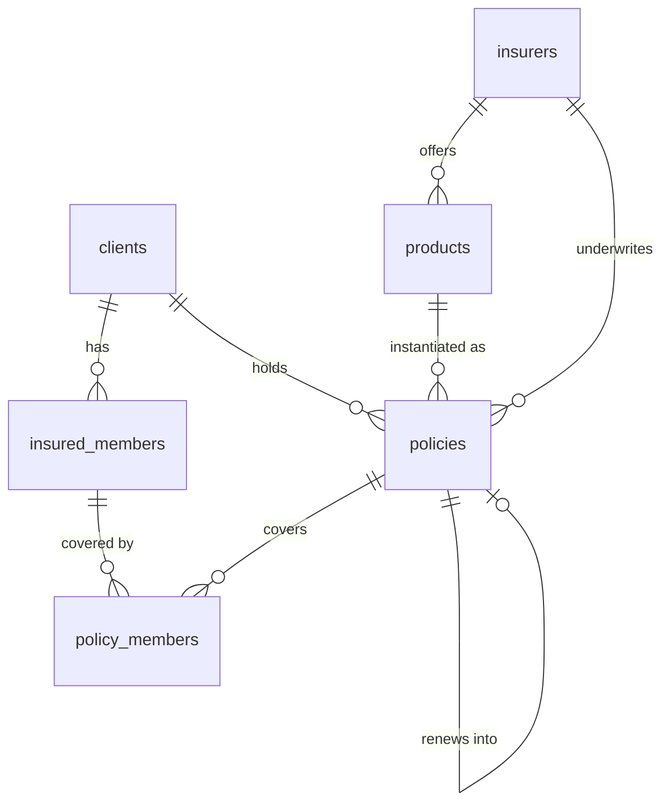

# Data model

The schema lives in `src-tauri/src/db/schema/`, applied by
`src-tauri/src/db/migrations.rs`. Everything below is one encrypted SQLite
database, `stayinsured.db`, opened through SQLCipher.

Current schema version: **2** — `001_init.sql` (structure) and `002_seed.sql`
(defaults). `session_state.schemaVersion` reports it at runtime.

## Migration policy

`MIGRATIONS` is an ordered list of `(version, sql)` compiled in with
`include_str!` and tracked in `PRAGMA user_version`. All pending steps run inside
one transaction when the database is opened.

**A shipped migration is never edited.** Users have already applied it, and
editing it changes nothing on their machine while silently diverging from the
schema fresh installs get. Any change is a new numbered file added to the list.

## Entities in use

### `clients`

The client book. `client_code` is unique and allocated as `CL-00001` upward from
the highest numeric suffix matching `CL-[0-9]*`.

Contact and identity: `full_name` (required), `email`, `phone`, `alt_phone`,
`date_of_birth`, `gender`, `address_line1`, `address_line2`, `city`, `state`,
`pincode`, `occupation`, `pan`, `gstin`. Behaviour: `preferred_language`
(default `en`), `reminders_opted_out`, `notes`, `is_archived`.

Names are title-cased, phones reduced to digits with an optional leading `+`, PAN
and GSTIN upper-cased, and blank text stored as `NULL`. Indexed on name, email,
phone, city and archived state.

### `insured_members`

Family members and dependents who can be covered by that client's policies.
Cascades on client delete. `relationship` is constrained to
`self | spouse | son | daughter | father | mother | other`.

### `insurers`

Insurance companies. `name` is unique, `short_code` is upper-cased and used for
import matching, plus `website`, `claim_helpline`, `support_email`, `notes` and
`is_active`. Twenty-five Indian insurers are seeded so the first policy can be
entered without setup.

### `products`

Plans an insurer offers. Unique on `(insurer_id, name)`, carries a `category`
from the category domain, and cascades on insurer delete.

### `policies`

One row per **policy year**, not per policy.

| Column group | Columns |
| --- | --- |
| Chain | `chain_id`, `policy_year`, `previous_policy_id` |
| Identity | `policy_number`, `client_id`, `insurer_id`, `product_id`, `category` |
| Lifecycle | `status`, `start_date`, `expiry_date` |
| Money | `sum_insured`, `premium_amount`, `gst_amount`, `premium_frequency`, `payment_mode`, `next_due_date`, `commission_rate`, `commission_expected` |
| Detail | `nominee_name`, `nominee_relation`, `vehicle_number`, `notes` |

Constraints: `UNIQUE (insurer_id, policy_number)`; `client_id` cascades on
delete; `insurer_id` is restricted; `product_id` and `previous_policy_id` are set
to `NULL` when their target goes. Indexed on client, expiry, status, chain,
category, insurer and previous policy.

### `policy_members`

Which insured members a policy year covers — `(policy_id, member_id)`, cascading
on both sides. The insert path only accepts members belonging to the policy's own
client.

## Domains

| Domain | Values | Enforced by |
| --- | --- | --- |
| Category | `health`, `life`, `motor`, `travel`, `home`, `personal_accident`, `critical_illness`, `other` | `CHECK` on `products` and `policies` |
| Policy status | `active`, `expired`, `renewed`, `lapsed`, `cancelled` | `CHECK` on `policies` |
| Premium frequency | `annual`, `half_yearly`, `quarterly`, `monthly`, `single` | `CHECK` on `policies` |
| Relationship | `self`, `spouse`, `son`, `daughter`, `father`, `mother`, `other` | `CHECK` on `insured_members` |
| Gender | `male`, `female`, `other` | `CHECK` on `clients` and `insured_members` |
| User role | `owner`, `staff`, `readonly` | `CHECK` on `users` |

Dates are ISO `YYYY-MM-DD` text. Timestamps are `datetime('now')`, so UTC.
Booleans are `INTEGER` 0/1. Money is `REAL`.

## Invariants

These hold across the whole database and the code depends on them.

1. **A policy year is never mutated by a renewal.** Renewing inserts a new row
   with the same `chain_id`, `policy_year + 1` and `previous_policy_id` pointing
   at the year it replaces.
2. **A chain has exactly one head.** The current year is the row in the chain
   with no successor — which is what `is_renewed = 0` means.
3. **Status is derived, except `cancelled`.** `sync_statuses` recalculates
   `active`, `expired`, `renewed` and `lapsed` from today's date and chain
   position on every unlock, after every real import, and on demand.
   `cancelled` is only ever set by hand and is never overwritten.
4. **A policy number is unique per insurer.** Two insurers may use the same
   number; one insurer may not. This is why a renewal needs a fresh number.
5. **A member only attaches to their own client's policies.** Enforced by the
   insert query, not just by the UI.
6. **Deleting a client removes their policies and members.** Archiving is the
   reversible alternative and what the interface offers first.
7. **An insurer carrying policies cannot be deleted.** Deactivation is the way to
   retire one.
8. **Blank means `NULL`.** Optional text is trimmed and empty values stored as
   `NULL`, so unique indexes and the "missing email" filter behave predictably.

## Derived objects

### `policy_overview`

The view every grid, filter, dashboard tile and export reads. It joins policy,
client, insurer and product, and adds two computed columns:

- `days_to_expiry` — `julianday(expiry_date) - julianday(date('now','localtime'))`,
  so it is live and follows the user's local midnight.
- `is_renewed` — whether any row's `previous_policy_id` points at this one.

Reading everything through one view is what stops the dashboard and the renewals
list from disagreeing about "expiring in 30 days". `POLICY_COLUMNS` in
`models.rs` pins the column order `Policy::from_row` expects, so the two must be
edited together.

### `clients_fts`

An FTS5 external-content index over `full_name`, `email`, `phone`, `client_code`
and `pan`, tokenised with `unicode61 remove_diacritics 2`. Three triggers
(`clients_fts_ai`, `_ad`, `_au`) keep it in step with `clients`. Client search
builds a prefix query from the search terms and falls back to a `LIKE` scan when
no searchable token survives.

### Touch triggers

`clients_touch` and `policies_touch` maintain `updated_at` on update.

## Supporting tables

### `users`

One `owner` row today, holding `display_name` and an Argon2 `password_hash`
separate from the database key, plus `role`, `is_active`, `created_at` and
`last_login_at`. The role domain is already in place for staff accounts.

### `settings`

Key/value store with `updated_at`, upserted by `save_settings`. Keys and defaults
are listed in [API.md](API.md#settings-keys).

### `import_batches` and `import_errors`

Every committed import records its file name, source type, counts and the mapping
JSON used, with each reported issue in `import_errors`. Dry runs write nothing.

## Reserved for unbuilt features

These tables are created and seeded where relevant, and no screen writes to them
yet. They exist because their shape constrains the design of what is built.

| Table | Purpose | State |
| --- | --- | --- |
| `email_templates` | Reminder and confirmation bodies with `{{placeholders}}` | 5 templates seeded and editable |
| `reminder_rules` | Offset ladder from expiry; positive is before, negative after | 60/30/15/7/1-day rules active, a 7-day-after rule inactive |
| `notification_log` | Send outbox, written before anything is sent | Empty |
| `premium_payments` | Installment schedule and receipts | Empty |
| `commissions` | Expected versus received payout | Empty; `policies` carries the summary fields the UI uses |
| `claims` | Claim intimation through settlement | Empty |
| `documents` | Scanned files against a client, policy, member or claim | Empty; `documents/` exists and the asset protocol is already scoped to it |
| `audit_log` | Before and after JSON per change | Empty |
| `saved_views` | Named filter sets per entity | Empty |

The load-bearing one is `notification_log`'s
`UNIQUE (rule_id, policy_id, policy_period)`: it is what will make a reminder
fire exactly once per policy year however often the scheduler sweeps or the app
restarts, and the tray-resident lifecycle exists so that sweep has somewhere to
run.
