# StayInsured — how to run your book

Everything StayInsured does, in the order you will do it. Each section is one
job: find it, follow it, move on.

Your book lives in one encrypted file on your own machine. There is no account,
no subscription and no internet connection involved.

- [Set up and open the app](#set-up-and-open-the-app)
- [Find your way around](#find-your-way-around)
- [Fill the book](#fill-the-book)
- [Work the renewals](#work-the-renewals)
- [Find and change records](#find-and-change-records)
- [Keep insurers and plans tidy](#keep-insurers-and-plans-tidy)
- [Settings, backups and housekeeping](#settings-backups-and-housekeeping)
- [Reference](#reference)

---

## Set up and open the app

### Install it

Download the file for your computer from the
[releases page](https://github.com/laksagent-png/StayInsured/releases).

**macOS** — open the `.dmg`, drag StayInsured into Applications, then
**right-click the app and choose Open** the first time. A double-click gives you
a warning with no way past it; right-clicking gives you an Open button. You do
this once.

**Windows** — run the `.exe`. When Windows says the publisher is unknown, choose
**More info**, then **Run anyway**.

Both warnings appear because the app is not registered with Apple and Microsoft.
Neither is a sign that anything is wrong.

### Create your book

The first launch asks for two things: your agency name, and a password.

The password encrypts the database. It is not stored anywhere and nobody can
reset it, so write it down and keep it where you keep anything else valuable.
Use at least eight characters.

Tick **Trust this device** to let the Keychain (Mac) or Credential Manager
(Windows) hold the key, which turns opening the app into a single click. Leave
it clear on a shared machine and type the password each time.

Press **Create encrypted database** and the book is ready.

### Open it each day

Type the password and press **Unlock**. On a trusted device the app unlocks
itself; **Use the saved key on this device** repeats that if you dismissed it.

**Lock app** at the bottom of the sidebar closes the book without quitting —
use it when you leave your desk.

Closing the window does not quit the app. It keeps running in the menu bar
(Mac) or system tray (Windows), where **Open StayInsured**, **Lock now** and
**Quit StayInsured** live. Quit from there when you mean it.

---

## Find your way around

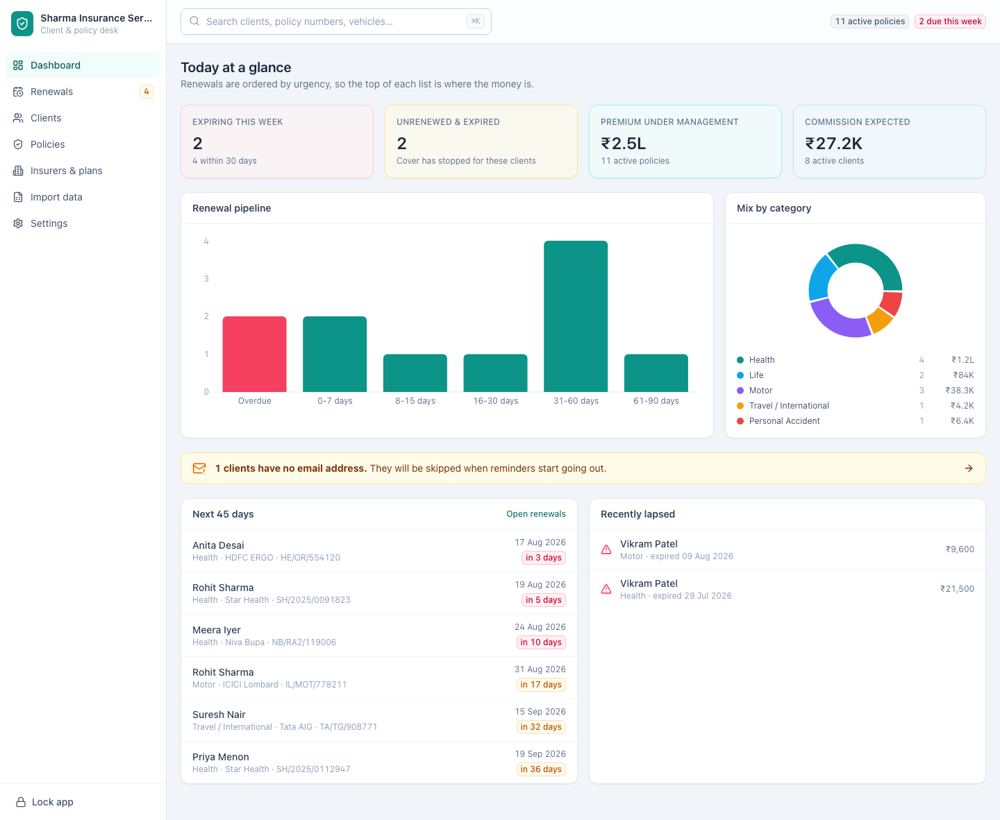

The sidebar holds the seven screens. The number beside **Renewals** is how many
policies expire within 30 days.

| Screen | What it is for |
| --- | --- |
| **Dashboard** (`/`) | The state of the book in one view |
| **Renewals** (`/renewals`) | The working list, ordered by urgency |
| **Clients** (`/clients`) | Everyone in the book |
| **Policies** (`/policies`) | Every policy year you have placed |
| **Insurers & plans** (`/insurers`) | The companies and products you sell |
| **Import data** (`/import`) | Bring a spreadsheet in |
| **Settings** (`/settings`) | Agency details, password, backups |

The search box at the top finds policies by policy number, client name or
vehicle number. Press **⌘K** (Mac) or **Ctrl+K** (Windows) to jump into it from
anywhere. Beside it, two badges track live cover and what is due this week.

Every number on the dashboard is a link:

- **Expiring this week** opens the renewals desk.
- **Unrenewed & expired** opens the policies that have lapsed.
- The amber banner opens the clients who have no email address.
- **Renewal pipeline** shows how the next 90 days are loaded, with overdue in red.
- **Mix by category** splits live cover across health, life, motor and the rest.
- **Next 45 days** and **Recently lapsed** link straight to the client.

An empty book shows the two ways to fill it instead.

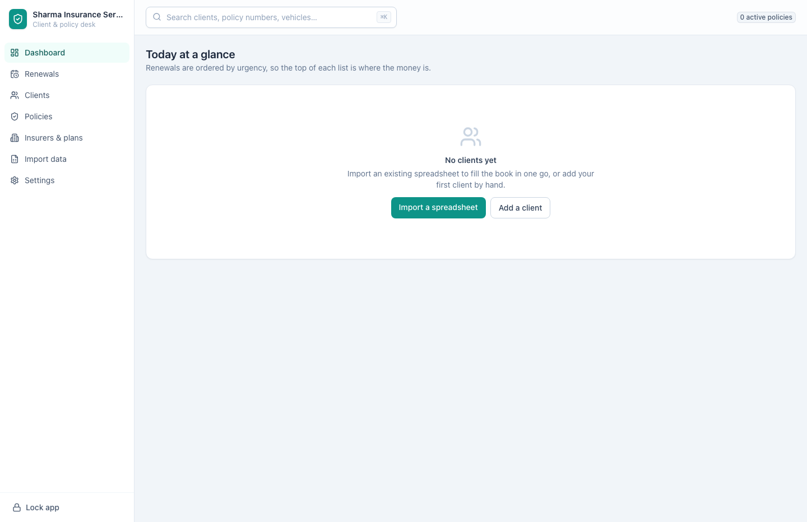

---

## Fill the book

### Import your spreadsheet

Import runs in three moves: match the columns, check without saving, then
commit. Nothing touches your book until the last step.

1. Open **Import data**. Click **Download template** to get a spreadsheet with
   every column the app understands, or skip it — your own file does not have
   to match the template.
2. Click **Choose a file** and pick a `.xlsx`, `.xls`, `.xlsm`, `.ods`, `.csv`
   or `.tsv`. Workbooks with several sheets get a **Sheet** picker.
3. Check the guesses on **Match your columns to fields**. The badge turns green
   and reads **Ready** once the four required fields are matched: **Client
   name**, **Policy number**, **Insurer** and **Expiry date**. Everything else
   is optional.

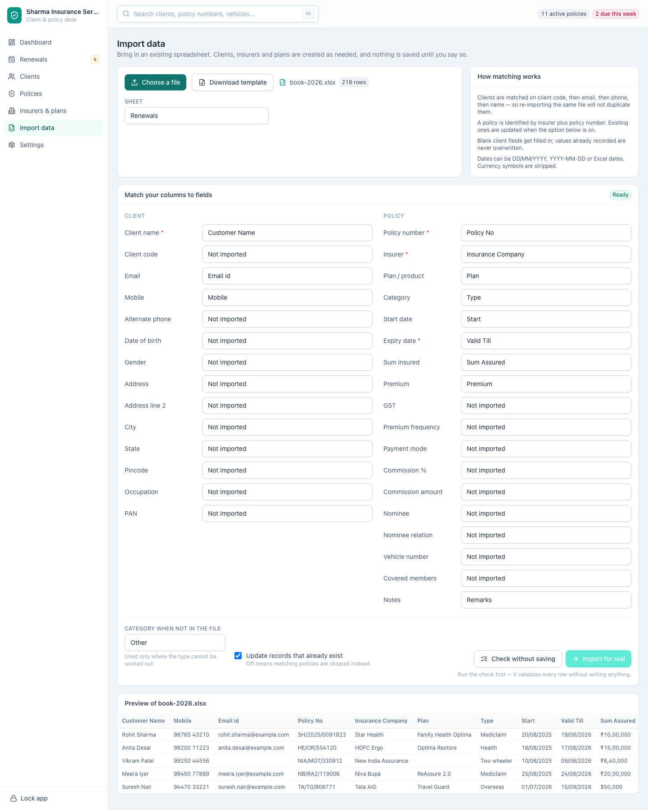

4. Set **Category when not in the file** for rows where the type cannot be
   worked out, and leave **Update records that already exist** on if a
   re-import should refresh policies you already hold. Turn it off to skip them
   instead.
5. Click **Check without saving**. This reads every row and reports exactly
   what it would do, naming each row it cannot make sense of. Nothing is
   written. Fix the spreadsheet and check again as often as you like.

6. Click **Import for real**. The button stays disabled until a check has run.
   The report then shows what happened, and **View policies** takes you to the
   result.

How the reader treats your file:

| Rule | What it means for you |
| --- | --- |
| Clients match on client code, then email, then phone, then name | Importing the same file twice changes nothing |
| A policy is identified by insurer plus policy number | Re-imports update that policy rather than duplicating it |
| Blank fields get filled in, filled fields are left alone | A later file can add missing phone numbers without overwriting anything |
| Dates read as `31/03/2026`, `2026-03-31` or real Excel dates | Mixed formats in one column are fine |
| Currency symbols and separators are stripped | `₹10,00,000` and `Rs. 24,500.50` both read correctly |
| Category is inferred from your wording | "Mediclaim" and "family floater" become Health, "term plan" Life, "two wheeler" Motor, "overseas" Travel |
| A failed row is skipped whole | You never get a half-created client |

### Add a client

Open **Clients** and press **New client**. Only the full name is required; the
client code is reserved for you and everything else can be filled in as you
learn it.

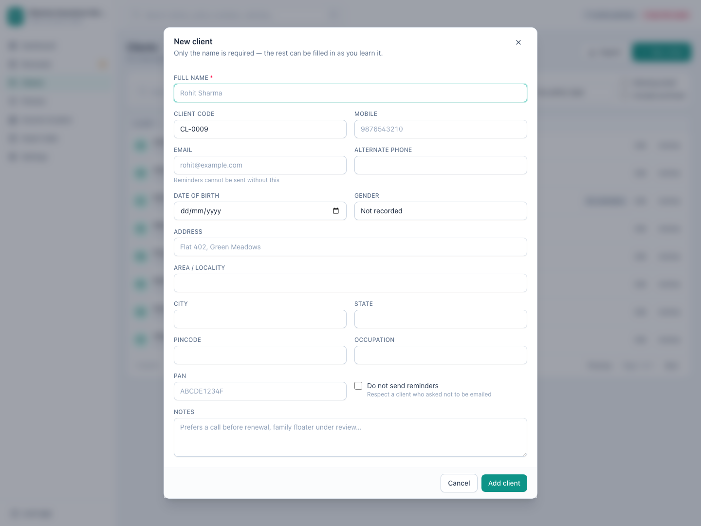

Record the email address if you have it — it is what future reminders will use.
Tick **Do not send reminders** for a client who asked not to be emailed, and
they stay out of every mailing list the app produces.

### Add the family members covered

Open the client and press **Add** on **Members covered**. Record the name,
relationship, date of birth and gender.

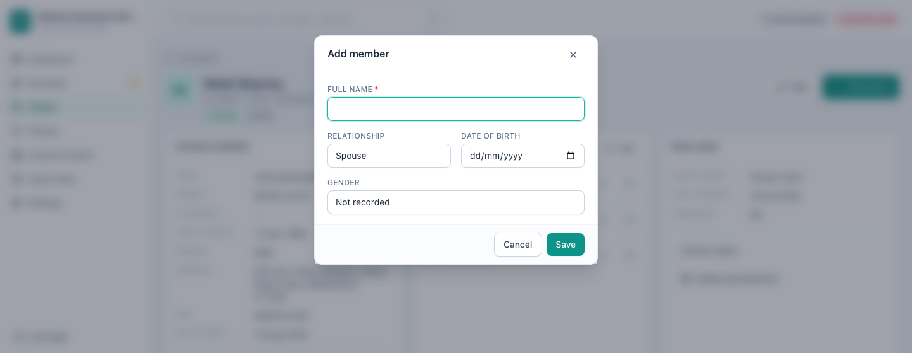

Members are recorded once against the client and then attached to whichever
health or travel policies cover them, so you know who is on a family floater
without opening the paperwork.

### Add a policy

Press **New policy** on the Policies screen, or **Add policy** on a client page
to skip choosing the client.

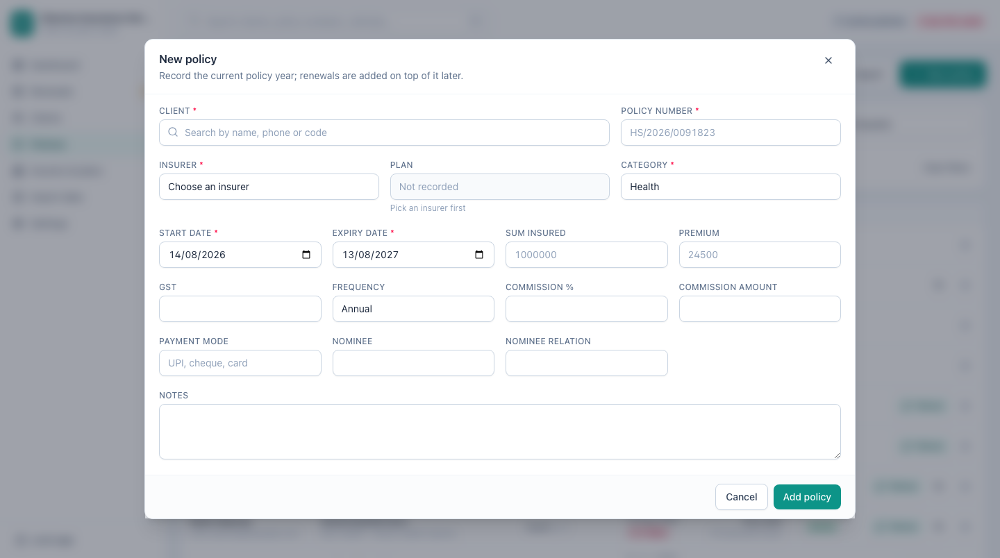

Client, policy number, insurer, category and both dates are required. The
expiry date fills itself in one year less a day after the start date, and you
can overwrite it. Enter a commission rate and the amount is worked out for you
unless you type your own. **Vehicle number** appears for motor policies, and the
members you recorded on the client appear as chips to tick.

One client holds as many policies as they need. Each carries its own number,
insurer, premium and expiry date, and each falls due in its own time.

---

## Work the renewals

### The desk

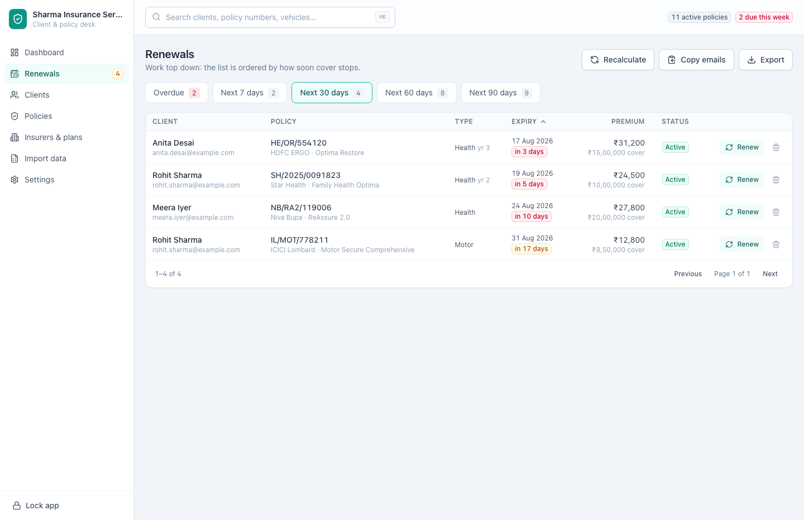

Policies are grouped by how soon cover stops: **Overdue**, then the next **7**,
**30**, **60** and **90 days**. Work down from the top of a tab, since the list
is ordered by urgency.

Three buttons run the desk:

- **Recalculate** rechecks every policy against today's date. Statuses move on
  their own; this forces it, which is worth doing first thing in the morning.
- **Copy emails** puts the email addresses from the tab you are looking at on
  the clipboard, ready to paste into your mail program. Clients with no address
  and clients who opted out are left out.
- **Export** saves the list you are looking at as Excel or CSV.

### Renew a policy

Press **Renew** on the row.

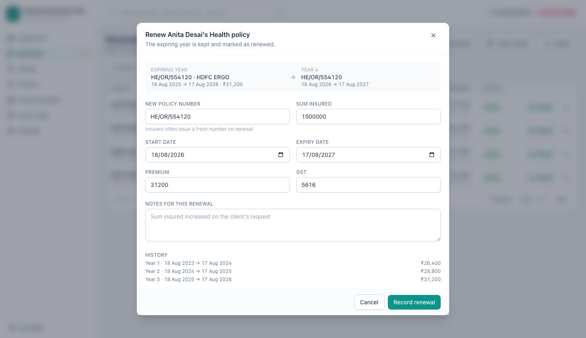

Last year's details are filled in, the dates run on from the expiring year, and
the premium field tells you how far you have moved from last year. Change what
the insurer changed, add a note, and press **Record renewal**.

Renewing never overwrites last year. It writes the new policy year, marks the
old one **Renewed**, and links the two, so what the client paid each year stays
on record.

### Read the history

On the **Policies** screen, press the history button on any policy past its
first year.

Each row is one policy year of the same underlying cover: the number it carried,
what it ran between, the premium and the sum insured.

---

## Find and change records

### Clients

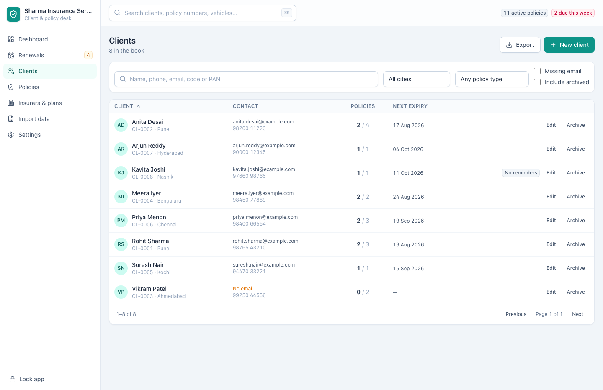

Search by name, phone, email, client code or PAN. Narrow the list by city, by
the kind of cover held, by **Missing email**, or bring archived clients back
into view with **Include archived**. Sort by client, by number of policies or by
next expiry. **Export** saves whatever the filters currently show.

On each row, **Edit** opens the client's details and **Archive** takes them out
of the working list without deleting anything. Archived clients show a badge and
restore with the same button.

### One client in full

Click a client's name to open their page.

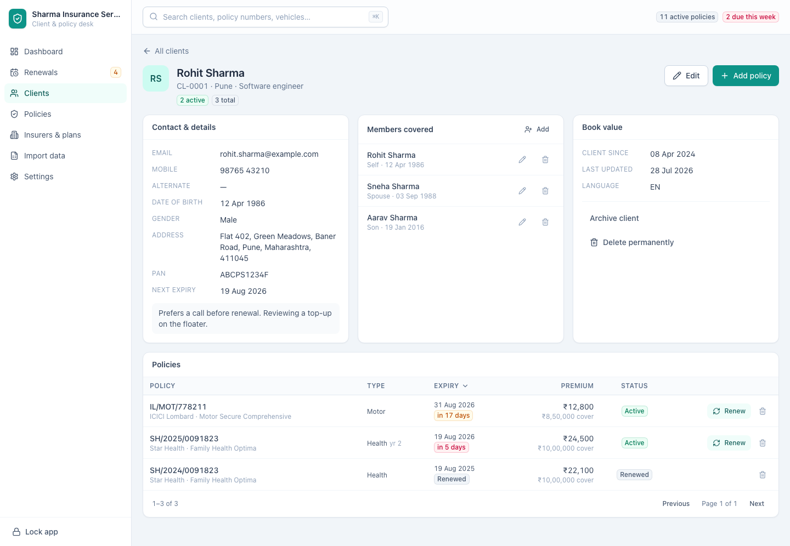

Contact details, the members covered, and every policy they hold sit together.
From here you can **Edit** the client, **Add policy**, add or remove members,
renew or edit any policy, and archive the client.

**Delete permanently** removes the client and every policy record with them. It
asks first, and it cannot be undone. Archive is what you want in almost every
case.

A client with no email address carries a warning, because reminders cannot
reach them.

### Policies

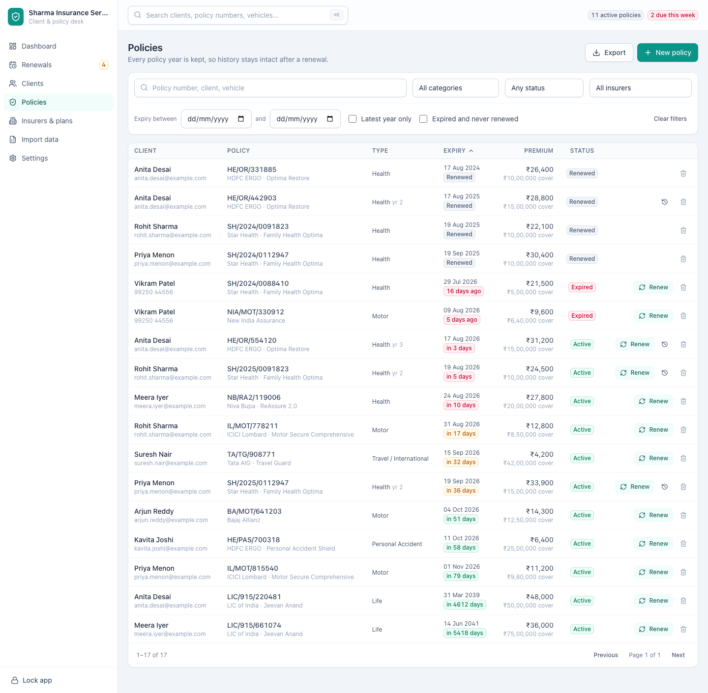

Search by policy number, client name or vehicle number. Filter by category,
status, insurer and expiry window, and use the two switches for the questions
you ask most:

- **Latest year only** hides superseded years and leaves the current picture.
- **Expired and never renewed** is the chase list: cover has stopped and nothing
  replaced it.

**Clear filters** resets the screen. Click any row to edit that policy year —
editing changes that year alone, so use **Renew** to add the next one. The
delete button removes a single policy year after asking.

---

## Keep insurers and plans tidy

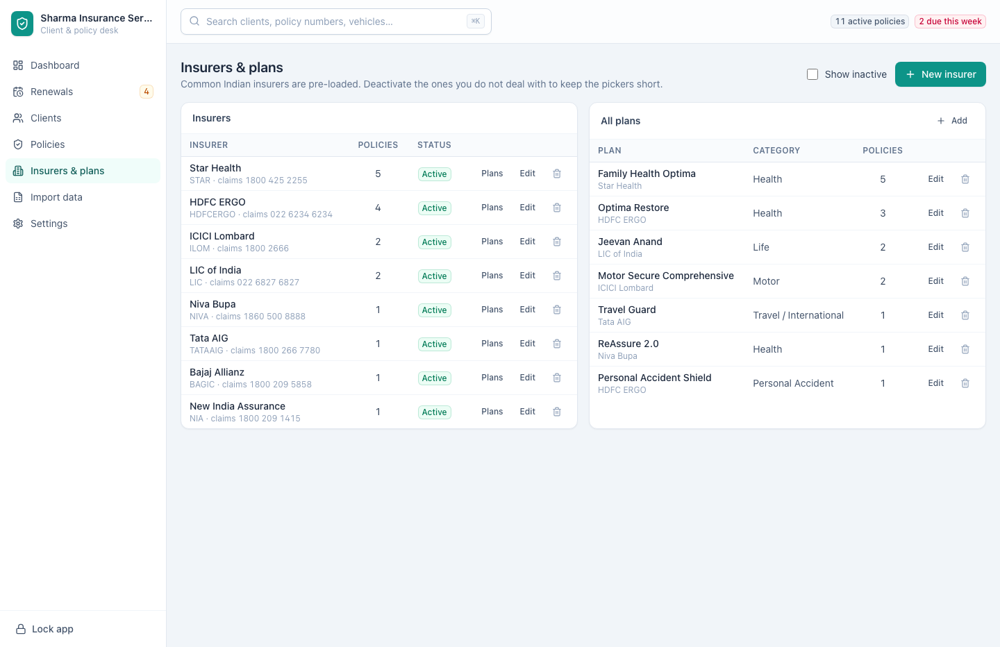

Common Indian insurers are pre-loaded. Keeping this list clean is what stops
"HDFC Ergo" being recorded three different ways.

- **New insurer** adds a company: name, short code, claims helpline, support
  email and website.
- **Plans** on an insurer's row filters the plans panel to that company;
  **Show all** goes back.
- **Add** on the plans panel records a plan against an insurer with its category
  and plan code.
- Clearing **Active** on either takes it out of the pickers while leaving it on
  every policy that already uses it. Tick **Show inactive** to see and restore
  them.
- The delete button removes an insurer or plan outright, and asks first.

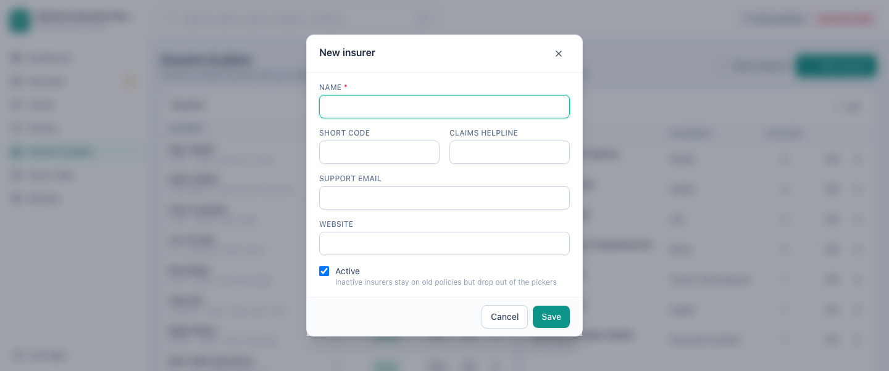

Plans are optional. Importing a file that names them creates them for you.

---

## Settings, backups and housekeeping

Nothing on this screen leaves your machine. **Save changes** at the top right
commits the whole screen, so make all your edits and save once.

### Your agency

Your name, contact email, phone and address appear in the app and in client
emails. **Expiring soon window** sets how many days ahead count as expiring
soon on the dashboard — set it to how far ahead you actually start chasing.
Amounts are in Indian rupees.

### Change your password

Enter the current password, then the new one twice, and press **Change
password**. The database is re-encrypted as part of it, so do this when you are
not mid-month-end.

**Stop trusting this device** removes the saved key, and the app asks for the
password next time. Use it before handing the machine to anyone.

### Back up your book

Your data is one encrypted file, so a backup is a copy of that file. Backups
carry the same encryption, which makes them safe to keep in cloud storage.

- **Copy backups to** takes a folder path. Point it at your Google Drive or
  Dropbox folder and every backup leaves the machine automatically, which covers
  you if the computer is lost.
- **Backups to keep** decides how many are retained before the oldest is
  dropped.
- **Back up now** writes one immediately.
- **Open data folder** opens the folder holding the database, backups and logs.
  Copying that folder to another machine moves the whole book.

### Reminders

Reminders are not sent automatically. The **Renewals** screen and its **Copy
emails** button are how you chase renewals today, and they take seconds.

The settings on this card are stored for the scheduler: what time to send,
how many to send per day, whether StayInsured starts at login, and whether it
raises a desktop alert for the day's expiries. Fill them in now and they are
used the moment sending is switched on.

---

## Reference

### Categories

Health · Life · Motor · Travel / International · Home · Personal Accident ·
Critical Illness · Other

### Statuses

| Status | Meaning |
| --- | --- |
| **Active** | Cover is running |
| **Expired** | Past its expiry date with nothing replacing it |
| **Renewed** | Superseded by the next policy year |
| **Lapsed** | Expired and written off |
| **Cancelled** | Ended before its expiry date |

### Keyboard

| Keys | Action |
| --- | --- |
| **⌘K** / **Ctrl+K** | Jump to search |
| **Esc** | Close the open dialog |

### Where your data lives

| System | Folder |
| --- | --- |
| macOS | `~/Library/Application Support/com.stayinsured.app` |
| Windows | `%APPDATA%\com.stayinsured.app` |
| Linux | `~/.local/share/com.stayinsured.app` |

The folder holds the encrypted database, your backups, and logs. **Settings →
Open data folder** takes you straight there.

### What the app does not do yet

Automatic reminder emails, stored scan copies of policy documents, claims
tracking, the printable report pack, and separate logins for your staff. Each
is planned; none of them is switched on.

### Questions

**Can two people share one book?** Not at the same time. Each installation keeps
its own data, and copying the data folder moves a book to a new machine.

**Is any of this on the internet?** No. Nothing leaves your computer unless you
point backups at a cloud folder yourself.

**What if I forget the password?** A trusted device can still open the book, and
you should change the password to something you will keep. Without one, the data
cannot be recovered by anyone. That is the other side of real encryption.

**Will updating lose my data?** No. A newer version replaces the app, not your
book.

**Something looks wrong.** Open an issue at
https://github.com/laksagent-png/StayInsured/issues saying what you did and what
happened. If a spreadsheet import upset it, name the column — but do not attach
a file with real client details in it.

---

The screens above are photographed from the running app against a demo
book, and are regenerated whenever the interface changes.
