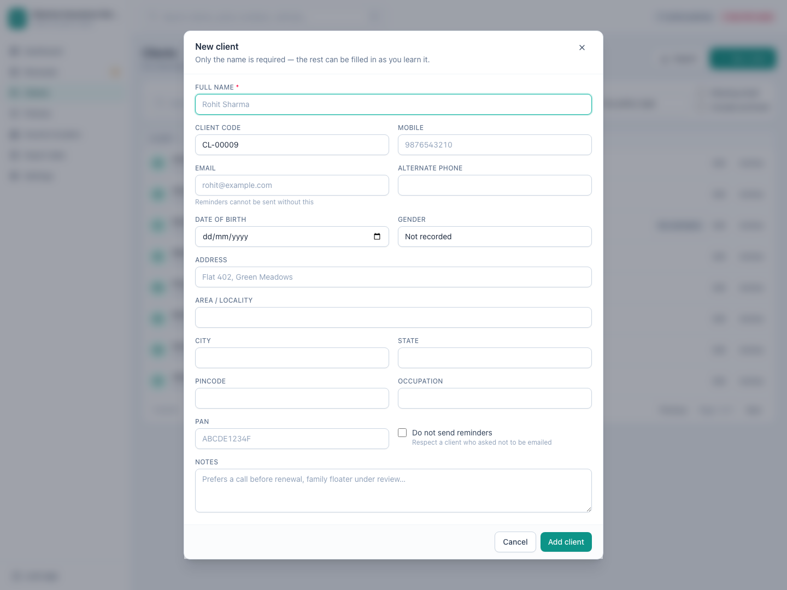
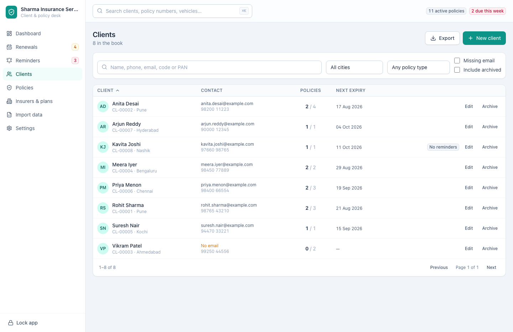
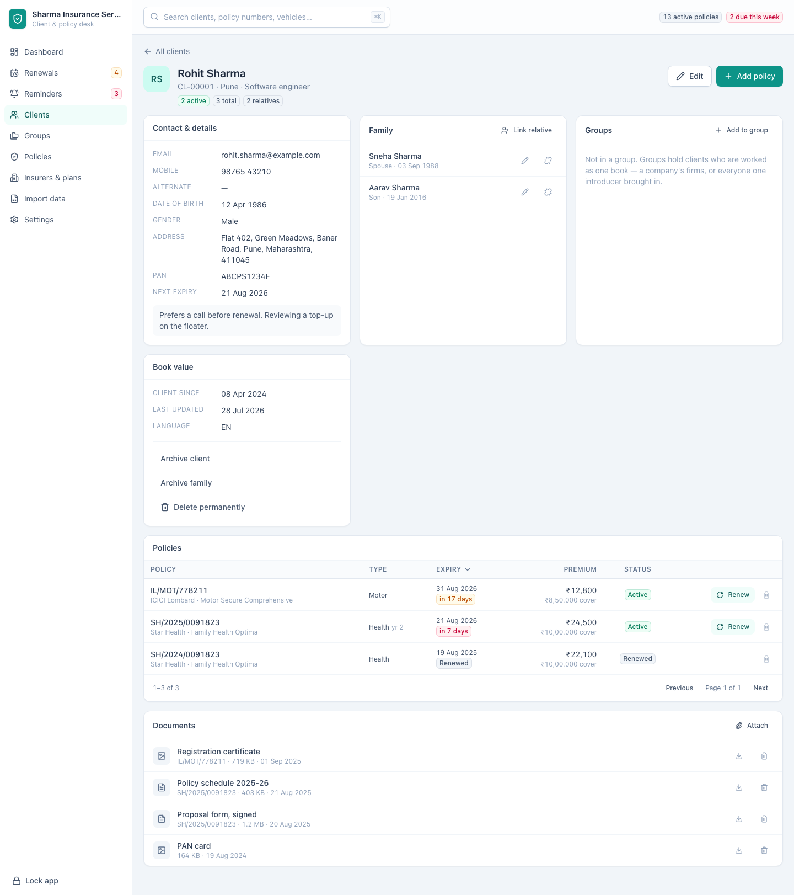

[← Guide contents](index.md)

# Manage clients

Everyone in your book lives on the **Clients** screen at `/clients`. This page
covers adding them, finding them again, and what happens when someone leaves.

- [Add a client](#add-a-client)
- [Every field on the client form](#every-field-on-the-client-form)
- [Find a client](#find-a-client)
- [Open one client in full](#open-one-client-in-full)
- [Edit a client](#edit-a-client)
- [Archive a client](#archive-a-client)
- [Delete a client](#delete-a-client)
- [Export the list](#export-the-list)

## Add a client

Press **New client**. Only the full name is required — record what you know now
and fill the rest in as you learn it.

Press **Add client** and they are in the book, ready for their first policy.
Enter from any of the text boxes does the same, so a whole client can be typed
without reaching for the mouse. **Cancel**, the cross in the corner and the
Escape key all close the form without saving.

Leave **Client code** empty and the app allocates the next one for you in the
form `CL-00001`. Type your own if you already number clients and want to keep
those numbers.

**Record the email address if you have it.** It is what every renewal mailing
list is built from, and a client without one carries a warning everywhere they
appear.

## Every field on the client form

| Field | Required | Notes |
| --- | --- | --- |
| **Full name** | Yes | The only required field |
| **Client code** | | Allocated as `CL-00001` if you leave it blank |
| **Mobile** | | Digits are cleaned up as they are stored |
| **Email** | | Reminders cannot be sent without this. An address that is not one is refused |
| **Alternate phone** | | A landline or a second number |
| **Date of birth** | | Used to know when age-banded premiums move |
| **Gender** | | Male, female or other |
| **Address** | | Street address |
| **Area / locality** | | |
| **City** | | Also a filter on the client list |
| **State** | | |
| **Pincode** | | |
| **Occupation** | | |
| **PAN** | | Searchable, so a PAN in hand finds the client |
| **Do not send reminders** | | Keeps this client out of every mailing list the app produces |
| **Notes** | | Anything you want to remember before you call them |

Tick **Do not send reminders** for a client who has asked not to be emailed. They
stay in your book and keep their policies, but **Copy emails** on the
[renewals desk](renewals.md) will never include them.

Two things stop a save: a client with no name, and an email address that is not
an address — `rohit@example` and `rohit at example.com` are both turned back.
The dialog says which it is, keeps everything you typed, and waits for you to
put it right.

## Find a client

| Control | What it does |
| --- | --- |
| Search box | Matches name, phone, email, client code or PAN |
| **All cities** | Narrows to one city. A screen reader calls it City |
| **Any policy type** | Narrows to clients holding that kind of cover. A screen reader calls it Policy type |
| **Missing email** | Only clients who cannot be emailed |
| **Include archived** | Brings archived clients back into view |
| Column headings | Sort by client, by number of policies, or by next expiry |

Filters combine, so "Mumbai, health, missing email" is one click each. The list
pages at the foot when there is more than a screenful.

Each row shows the client's contact details, how many of their policies are
active out of the total, and when the next one expires — enough to decide who to
call without opening anyone. A client with no email address is marked **No
email** in amber on their row.

Three answers are told apart rather than run together. A search that matches
nobody says **No clients match** and suggests clearing the filters. A book with
nothing in it yet says **Nothing in the book yet** and offers **Add a client**.
A book that could not be read says so and offers **Try again** — an empty table
is never used to mean a failure.

## Open one client in full

Click a client's name.

Everything about them is on one page: contact details, the
[members they cover](insured-members.md), every policy they hold with its status
and expiry date, and the [documents](documents.md) you have attached.

From here you can **Edit** the client, **Add policy** without choosing the client
again, add or remove members, and renew or edit any policy on the list. A client
with no email address carries an amber line across the top of their page saying
they cannot receive renewal reminders.

An address that names nobody — a deleted client, or a mistyped one — says
**Client not found** rather than an empty page. A client the book could not read
says so, and offers **Try again**.

## Edit a client

Press **Edit** on the client's row or on their page. The form is the one you
filled in when adding them, and **Save changes** commits it. Editing a client
never touches their policies.

## Archive a client

**Archive** on the client's row takes them out of the working list without
deleting anything. Their policies, history and members stay exactly as they are.
The same thing sits on their own page as **Archive client**.

Archive is the right answer when someone stops buying from you: the record stays
for reference, and the client stops cluttering your day.

Archived clients carry an **Archived** badge and reappear with **Include
archived**. The button that put them there then reads **Restore** on the row and
**Restore client** on their page.

## Delete a client

**Delete permanently** on the client's page removes the client and every policy
record belonging to them. It asks first, naming the client and counting the
policy records that go with them, and nothing brings them back.

Use it for a duplicate or a record created in error. For a real client who has
left, archive instead.

## Export the list

**Export** saves whatever the filters currently show as Excel or CSV. Filter
first, export second — "health clients in Pune with no email" is a filtered list
and then one button.

---

Next: [record the members they cover](insured-members.md) or
[add their policies](policies.md).
