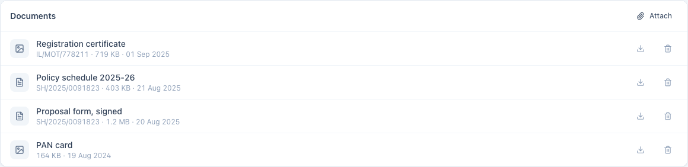
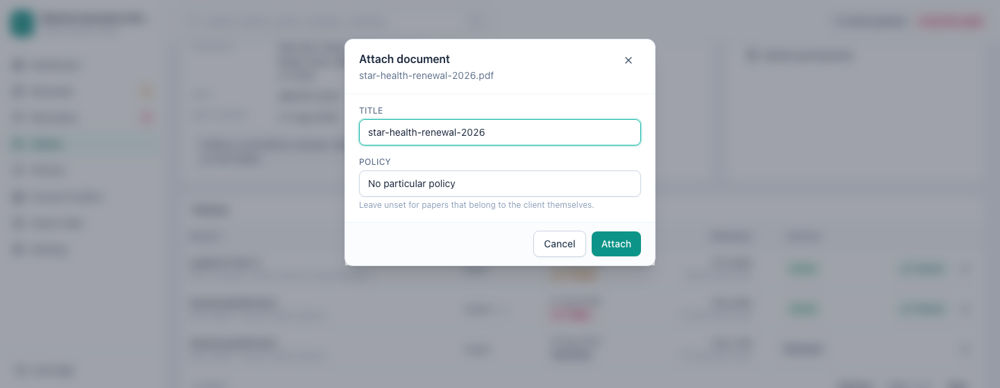

[← Guide contents](index.md)

# Keep the paperwork

The policy schedule, the signed proposal, the RC book, the PAN card. Attach them
to the client and they are one click away when the client rings, instead of
somewhere in a folder named after a year.

- [Where documents live](#where-documents-live)
- [Attach a document](#attach-a-document)
- [Open one](#open-one)
- [Save a copy to send on](#save-a-copy-to-send-on)
- [Remove one](#remove-one)
- [What it will and will not take](#what-it-will-and-will-not-take)

## Where documents live

Every client page has a **Documents** panel underneath their policies.

Each row shows what the file is, which policy it belongs to, how big it is and
when you attached it. The newest is at the top.

The files are kept **inside your encrypted book**, not in a folder beside it.
Three things follow from that, and they are the reason it was built this way:

- A [backup](backups-and-data.md) carries your scans with it. There is no second
  folder to remember.
- The scans are encrypted with the same password as everything else. A stolen
  laptop does not hand over your clients' PAN cards.
- Moving to a new computer moves the paperwork too, because it is all one file.

## Attach a document

Press **Attach** on the panel and pick the file.

| Field | Notes |
| --- | --- |
| **Title** | What you will recognise it by. Starts as the file's own name, and you can rewrite it |
| **Policy** | Which policy this belongs to. Leave it on *No particular policy* for papers about the client themself, like an ID proof |

**Your own file is not moved or changed.** The app takes a copy. Delete the
original, tidy your Downloads folder, empty the bin — what you attached stays in
the book.

## Open one

Click the title of any row and it opens in the app. PDFs and photographs both
show in place, so checking a sum insured is not a trip out to another program.

Nothing is written to your disk to do this. The file is read out of the encrypted
book and shown, and it is gone from memory when you close the window.

## Save a copy to send on

The download button on a row asks where to put a copy, then writes it there.
That is the way to email a schedule to a client, or hand it to a surveyor.

This is the only thing that puts a document back on your disk as an ordinary,
unencrypted file. It happens because you asked, at the place you chose.

## Remove one

The remove button takes the document out of the book, after asking. That cannot
be undone, and the copy inside the book is the one it deletes — your original,
wherever you got it from, is untouched.

Deleting a **client** takes their documents with them. Deleting a **policy** does
not: the paperwork stays on the client and simply stops naming a policy, because
last year's schedule is often the thing you need after the policy row has gone.

## What it will and will not take

| | |
| --- | --- |
| **Takes** | PDF, PNG, JPG and WEBP |
| **Limit** | 20 MB per file |
| **Refuses** | Anything else, saying so rather than half-attaching it |

Two limits worth understanding rather than working around:

**The 20 MB ceiling** is there because every backup copies the whole book. A
handful of enormous scans makes every backup slower, for a document nobody reads
at that resolution. If your scanner produces 40 MB files, scan at a lower
setting.

**The same file twice on one client is refused.** The app compares the contents,
not the name, so `schedule.pdf` and `schedule-copy.pdf` are caught as the same
document. Attaching the same form to two different clients is fine.

---

Next: [work the renewals](renewals.md), or read how
[backups](backups-and-data.md) carry all of this off the machine.
