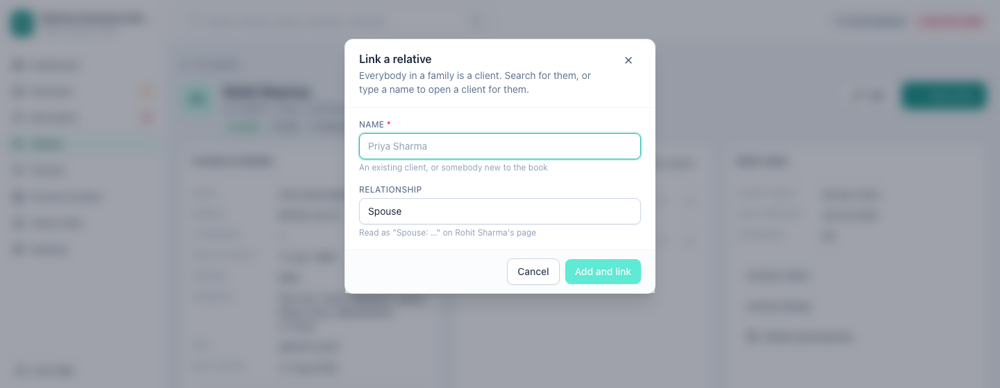

[← Guide contents](index.md)

# Record a family

A family floater covers four people under one policy number. All four are
clients: a wife, a son and a father are people in your book like anybody else,
and the book records how they are related rather than filing them inside each
other.

- [Why families are clients](#why-families-are-clients)
- [Link a relative](#link-a-relative)
- [Read a relationship from either end](#read-a-relationship-from-either-end)
- [Cover a relative on a policy](#cover-a-relative-on-a-policy)
- [Family members in the clients list](#family-members-in-the-clients-list)
- [Change or remove a relationship](#change-or-remove-a-relationship)
- [Archive or delete a household](#archive-or-delete-a-household)

## Why families are clients

Because a child becomes a policyholder. The son on his father's floater takes out
his own two-wheeler policy at eighteen; the wife covered under her husband buys a
term plan of her own. When a family member is a client from the start, that day
is a new policy against a person already on file — not a re-typing of somebody
who existed only as a line inside somebody else.

It also means one person can belong to two families at once. A married man is in
his wife and children's family and in his parents'; the book records both without
having to choose.

With relationships recorded you can answer, without opening the paperwork:

- Who exactly is covered under this floater?
- Is the son still on the policy now he has turned twenty-five?
- Which of my clients has a parent covered, so the premium jumps at renewal?

## Link a relative

Open the client and press **Link relative** on the **Family** panel.

| Field | Required | Notes |
| --- | --- | --- |
| **Name** | Yes | Type two letters and the book offers matching clients. Pick one to link them, or keep typing a name nobody has entered yet |
| **Relationship** | | Spouse, son, daughter, father, mother, brother, sister or other. Starts on spouse |

**Add and link** opens a client for somebody new to the book, at this client's
address, and records the relationship. **Save** links a client you picked from
the list, and no second copy of them is created.

The hint under the relationship reads the record back to you — *Read as "Son:
Aarav Sharma" on Rohit Sharma's page* — so you can see which way round the word
is going before you save it.

Until anybody is linked, the panel reads *Link a spouse, child or parent to cover
them on a floater. Everybody in a family is a client in their own right.* A panel
that could not be read says so instead, with a **Try again** beneath it.

## Read a relationship from either end

A relationship is recorded once, in the direction you entered it. On Rohit's page
his son reads **Son**; on the son's page the same one record reads **Son of**.
The word does not flip to its opposite, because a book that guessed "father" from
"son" would have to guess the gender too, and would be wrong about a mother.

A relative's name on the panel is a link to their own client page, with their own
policies, documents and family.

## Cover a relative on a policy

The people linked to a client appear as chips on the [policy form](policies.md),
alongside the policyholder. Tick the ones this policy covers when you add or
edit it. Only the holder and the people related to them can be named: a policy
cannot quietly cover a stranger.

An [imported file](import-your-book.md) with a covered-members column does this
for you. Names split on commas, semicolons, slashes and pipes are matched against
the client themselves, then the people already in their family, then clients of
that name — and only failing all three is a new client opened for them. Importing
the same sheet twice therefore finds the same people rather than making second
copies of them.

## Family members in the clients list

A book of two thousand policyholders holds several thousand people once families
are in it. So [the clients list](clients.md) browses the people who hold the
cover, and marks anybody else **Family member**. Tick **Include family members**
to see everybody.

Search reaches the whole book either way. Typing a child's name finds the child,
ticked or not, because a book that held somebody but would not admit it when
asked by name would be worse than one that never held them.

Somebody stops being a family member the moment they take out a policy of their
own — nothing has to be moved or re-entered.

## Change or remove a relationship

Each row on the **Family** panel ends with two buttons that name the person they
act on — **Change how Sneha Sharma is related**, **Unlink Sneha Sharma**. Hover
either and it says whose row you are on, so there is no counting down a family of
five to be sure which life you are about to change.

Changing the relationship rewrites the one record, from whichever page you are
on. Unlinking asks first, by name, and removes only the link: the person stays in
the book as a client, with their own policies untouched.

Unlinking does not change any policy's premium or sum insured. It only changes
who you have recorded as covered.

## Archive or delete a household

A household usually leaves together, and doing them one at a time is how half a
family is left behind. On the client's page, under **Book value**:

| Choice | What it reaches |
| --- | --- |
| **Archive client** | This client alone |
| **Archive family** | This client and the people linked to them |
| **Delete permanently** | Asks whether to delete this client only, or this client and the people linked to them |

Both family choices reach one step out and stop. An in-law's own parents are
their own household, and a delete that followed the family outwards would take
them too.

Deleting a client on its own leaves their relatives standing as clients — only
the links to them go. The delete dialog lists the family on file first, with
whose policies are their own, so you can see what you are about to lose before
you choose.

---

Next: [record their policies](policies.md).
