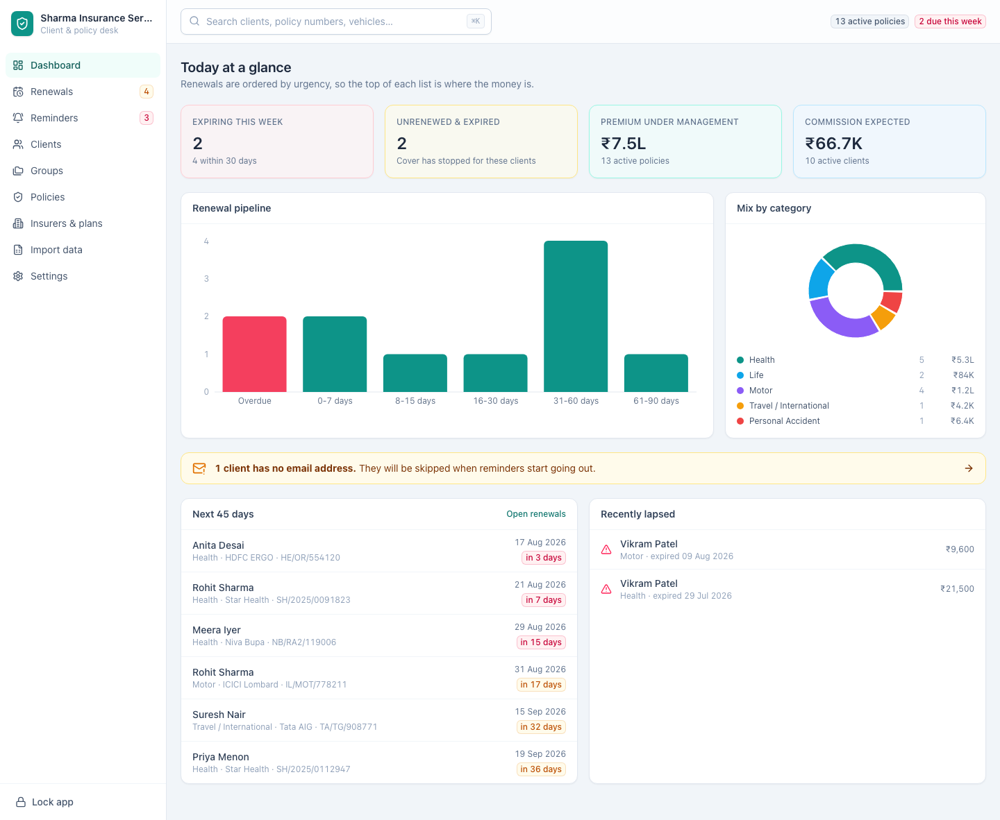
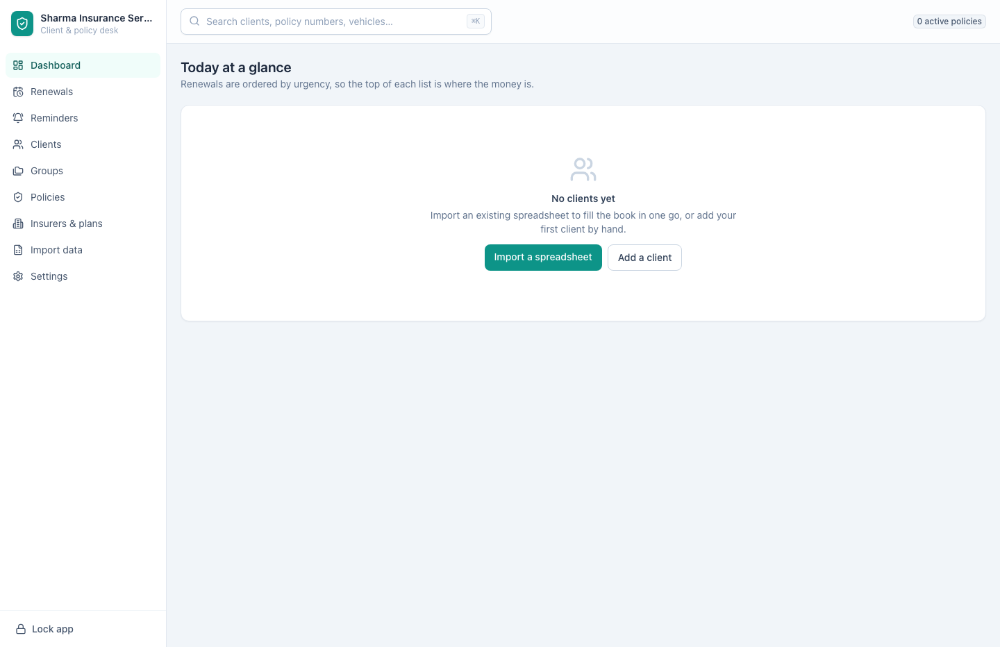

[← Guide contents](index.md)

# Find your way around

The eight screens, the search box, and how to read the dashboard.

- [The sidebar](#the-sidebar)
- [Search and the badges](#search-and-the-badges)
- [Read the dashboard](#read-the-dashboard)
- [An empty book](#an-empty-book)

## The sidebar

| Screen | Address | What it is for |
| --- | --- | --- |
| **Dashboard** | `/` | The state of the book in one view |
| **Renewals** | `/renewals` | The working list, ordered by urgency |
| **Reminders** | `/reminders` | What the app writes to clients, and when |
| **Clients** | `/clients` | Everyone in the book |
| **Policies** | `/policies` | Every policy year you have placed |
| **Insurers & plans** | `/insurers` | The companies and products you sell |
| **Import data** | `/import` | Bring a spreadsheet in |
| **Settings** | `/settings` | Agency details, password, backups, your mail server |

The number beside **Renewals** counts the policies expiring within 30 days. It
updates as you work, so a bare **Renewals** means the next month is clear.

The number beside **Reminders** counts what is due to go out today plus anything
that failed to send. It turns red when something has failed, because those are
the clients who did not hear from you.

Your agency name sits at the top of the sidebar and **Lock app** at the foot.

## Search and the badges

The search box at the top finds policies by **policy number**, **client name**,
**client code**, **registration number**, **engine number** or **chassis
number**. Press **⌘K** on a Mac or **Ctrl+K** on Windows to jump
into it from anywhere. Press **Enter** and the policies list opens, filtered to
what you typed — including when the policies list is already the screen you are
on, so a second search from there narrows the list under you. **Escape** hands
the keyboard back to the screen behind the box, and closes any dialog that is
open.

Two badges sit beside the search box:

- **14 active policies** — how many are running right now.
- **3 due this week** — how many expire within seven days. It only appears when
  something does, and when it appears it is your day's work.

## Read the dashboard

Nothing here has to be counted by hand, and the panels that lead somewhere are
links to the list behind them.

| Panel | What it tells you | Where it goes |
| --- | --- | --- |
| **Expiring this week** | Cover stopping within seven days, with the count for the next 30 days under it | The renewals desk |
| **Unrenewed & expired** | Cover that stopped with nothing replacing it | The chase list on the policies screen |
| **Premium under management** | Premium on all active policies, with how many those are | — |
| **Commission expected** | Commission on all active policies, with how many clients they cover | — |
| **Renewal pipeline** | How the next 90 days are loaded, overdue in red | — |
| **Mix by category** | Live cover split across health, life, motor and the rest, with the premium in each | — |
| Amber banner | Clients with no email address | Those clients, filtered |
| **Next 45 days** | The nearest expiries, soonest first | The client behind each row, or **Open renewals** for the desk |
| **Recently lapsed** | Cover that has stopped and needs chasing | The client behind each row |

Work the dashboard top to bottom in the morning: clear **Expiring this week**,
then look at **Recently lapsed** for anyone who slipped.

The seven and thirty days on this screen are fixed. The **Expiring soon window**
in [Settings](settings.md) is a different figure, and shapes your daily digest
rather than anything here.

When the book cannot be read, **Your book could not be read** takes the place of
the whole screen, with the reason and a **Try again** button, rather than a set
of zeroes that would read as an empty book. The counts beside the search box and
in the sidebar drop away at the same time, for the same reason.

## An empty book

Before there is anything to show, the dashboard offers the two ways to fill it:
[import a spreadsheet](import-your-book.md) or
[add a client by hand](clients.md).

---

Next: [work the renewals](renewals.md).
