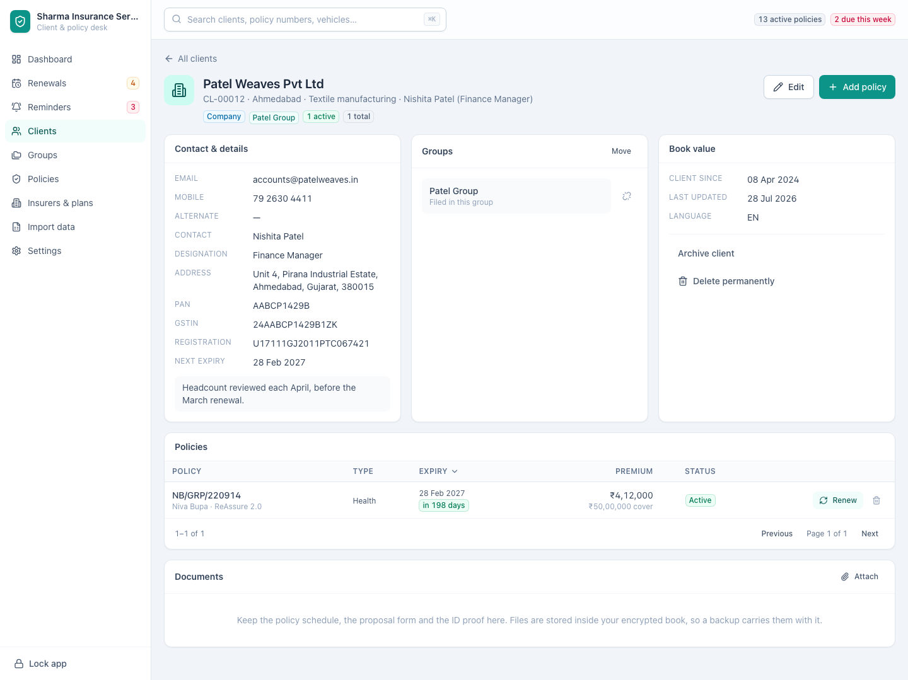
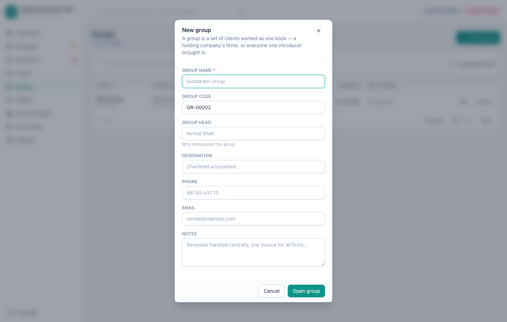
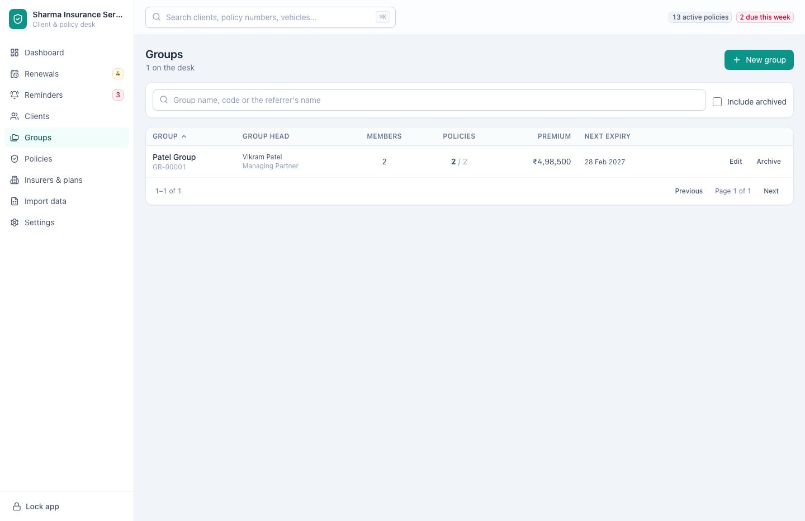
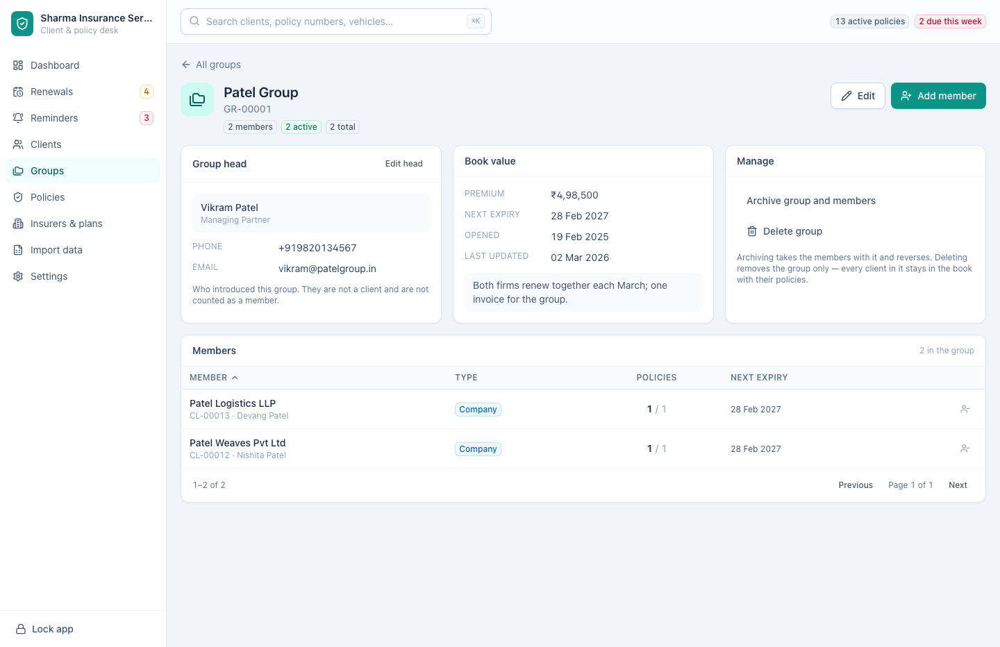

[← Guide contents](index.md)

# Companies and groups

Not every client is a person. A firm buying group health for its staff holds
policies, renews them and needs chasing exactly like anybody else — it just has
no date of birth, and the name to ask for on the phone is not the name on the
policy. And firms rarely arrive one at a time: a holding company brings its
subsidiaries, an introducer brings ten unrelated businesses, and you work the lot
as one book. A **group** is that lot.

- [Enter a company](#enter-a-company)
- [Open a group](#open-a-group)
- [The group head](#the-group-head)
- [Put clients in a group](#put-clients-in-a-group)
- [Read a group](#read-a-group)
- [Take somebody out, archive, or delete](#take-somebody-out-archive-or-delete)
- [Why a group is not a family](#why-a-group-is-not-a-family)

## Enter a company

Every client form starts with **Client type**. Leave it on **Individual** for a
person; switch it to **Company** and the form asks a firm's questions instead of
a person's.

| Field | Replaces | Notes |
| --- | --- | --- |
| **Company name** | Full name | The entity on the policy — *Patel Weaves Pvt Ltd*, not the director |
| **Contact person** | Date of birth | The human who answers when you ring about a renewal |
| **Designation** | Gender | *Finance Manager*, *HR Manager*, *Partner* |
| **Industry** | Occupation | The same box, asked the way it makes sense of a firm |
| **GSTIN** | | Drawn only for a company, because it is what the insurer asks for |
| **Registration number** | | CIN, LLPIN or whatever the registrar issued |

PAN, address, phone and email are the same on both.

Switching the type after you have started typing removes the boxes that no
longer apply, and what was in them is not saved. A date of birth you typed
before realising you were entering a firm does not survive in the record where
you can no longer see it.

Everything else treats a company as a client: it holds policies, it appears in
renewals, it can be archived, it exports. On [the clients list](clients.md) the
**Client type** filter narrows the book to **Companies only** or **People
only** — the corporate desk and the retail desk are rarely the same afternoon's
work.

## Open a group

**Groups** in the sidebar, then **New group**. An empty desk offers **Open a
group** in the middle of the screen instead.

| Field | Required | Notes |
| --- | --- | --- |
| **Group name** | Yes | *Patel Group*, *Sundaram Group* |
| **Group code** | | Reserved for you as *GR-00001*; type your own numbering over it |
| **Group head** | | Who introduced this group. A name you type, not a client you pick |
| **Designation** | | *Chartered accountant*, *HR Manager*, *Broker* |
| **Phone** | | The number you ring when the whole group is due |
| **Email** | | An address that is not one is turned back |
| **Notes** | | How the group is worked — one invoice, renewals together, who signs off |

Only the group name is required. Open the group when you know which firms belong
together, and fill the head in later — or never, if nobody introduced them.

## The group head

The group head is whoever introduced the group, written down on the group itself:
a name, what they do, a phone number and an email address.

They are **not** a client, and naming one does not put anybody in your book. The
person who sends you work is usually a broker, an HR manager at the parent
company or an accountant recommending you to their clients — somebody worth
ringing and never worth insuring. Entering them as a client would have them
counted in your client total, sitting in your clients list holding no policies,
and turning up in every export as a policyholder with nothing to their name.

So the head sits apart from the book entirely:

- The group head is **not** counted in the group's member count.
- The group's totals are the members' policies and nothing else.
- Archiving or deleting the group does nothing to anybody.
- Deleting a client does nothing to any group, even one they introduced.

A phone number is stored the way a client's is — spaces and dashes cleaned off —
the name is tidied for capitals, and an email that is not an address is refused
with *The group head's email is not an address*. Leave the boxes blank and
nothing is stored.

A group with nobody down as its head reads **No referrer on file**, on the list
and on the group's own page. **Edit head** on the head card is where you name one
when you find out.

## Put clients in a group

From the group's page, **Add member**:

Search the book and pick the firm. If it is not there yet, **New company** opens
the client form ready for a company, already filed into this group, so it lands
where you meant as soon as it is saved. Either way a member is a client in its
own right, with its own page, policies and paperwork — a group never holds a
company inside itself.

The client form files a client too, so you can do it while you are entering them
rather than afterwards. **Group** lists every group you have and starts on **No
group**. Choose **Open a new group…** and a **New group name** box appears: the
group is opened when you press **Add client**, and the client is filed straight
into it. Type the name of a group you already have and they join that one instead
of a second group with the same name.

From the other direction, any client's page has a **Groups** card with **Add to
group**, and **Move** once they are in one.

A client sits in one group at a time. Putting somebody into a group is therefore
how they leave the last one, and the search says which group they are currently
in before you move them.

Editing a client leaves the group they are in alone unless you change **Group**
yourself, so saving a corrected phone number cannot tip a firm out of the group
it belongs to.

An [imported file](import-your-book.md) with a group column does this in bulk.

## Read a group

The list gives each group its head with their designation underneath, how many
members it holds, the active and total policies across all of them, the premium
under management, and the next date anything in the group expires. Search reaches
the group's name, its code and its head's name, so *Vikram* finds the group
Vikram brought you. Sort by premium to see which groups carry the book.

The group's own page puts the head in a card of their own, with their designation,
phone and email; the rolled-up book beside it; and the roster underneath, marked
**Company** or **Individual**, each with its own policy counts and next expiry. A
member's name leads to their client page. The head's does not — they are a
contact, not a client, so there is no page to open.

Those roll-ups add up the members and nobody else.

## Take somebody out, archive, or delete

Three different things, and the difference matters:

| Action | Where | What happens |
| --- | --- | --- |
| Take a member out | The button at the end of their row, named for them | They leave the group and stay in the book, with every policy and document intact |
| **Archive group and members** | The group page, under **Manage** | The group and everybody filed in it are put away together. **Restore group and members** puts them all back |
| **Delete group** | The group page, under **Manage** | The group is removed. Every client in it stays |

Deleting asks first, and the dialog says how many clients survive it before you
choose. The button is worded as what it does — **Delete the group, keep the
clients** — because a folder that took its contents with it is the reasonable
thing to fear here. A group is a filing arrangement, not an owner.

Archiving from [the groups list](#read-a-group) works the same way, and the
message afterwards counts what went with it: *Group archived with 2 clients*, so
you know the row you pressed reached further than the row.

## Why a group is not a family

Both put clients together, and they behave differently on purpose.

A [family](families.md) has no edges you can draw a line around. It is whoever
the relationships reach; a married man is in his wife's family and his parents'
at once, and nothing has to choose between them. So a family is not a thing in
the book — it is what the links between people add up to, and archiving one
reaches one step out and stops.

A group has exactly the boundary a family lacks. You name it, you put clients in
it deliberately, a firm is in one of them, and you can say where it ends. That is
why a group can be listed, sorted, archived, reported on and deleted as itself,
and a family cannot.

The practical consequences:

- Being in a group is not being related. A policy held by one firm in a group
  cannot cover another firm in it; only [a client's family](families.md) can be
  named on their policy.
- A company with no policies of its own is still a full client. The **Family
  member** rule that keeps dependants out of the browsing list looks at
  relationships only, so a firm you have entered but not yet written cover for is
  in the clients list where you left it.
- A group is a folder and nothing more. Its head is a name and a phone number
  written on the folder, not a client, so nothing about a group reaches into your
  book except the list of who is filed in it.

---

Next: [record their policies](policies.md), or
[bring a corporate book in from a spreadsheet](import-your-book.md).
