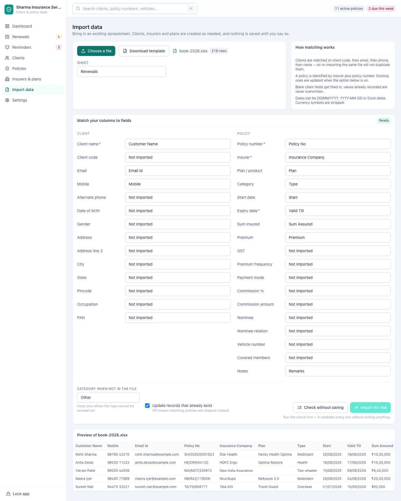
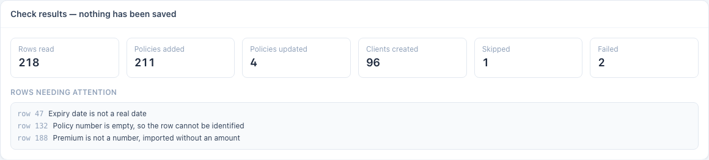

[← Guide contents](index.md)

# Import your book

Bring an existing spreadsheet in — clients, policies and history together —
without retyping any of it. Import runs in three moves: match the columns, check
without saving, then commit. Nothing touches your book until the last move.

- [Prepare the file](#prepare-the-file)
- [Step 1: choose the file](#step-1-choose-the-file)
- [Step 2: match the columns](#step-2-match-the-columns)
- [Step 3: check without saving](#step-3-check-without-saving)
- [Step 4: import for real](#step-4-import-for-real)
- [Columns the app recognises](#columns-the-app-recognises)
- [How your file is read](#how-your-file-is-read)
- [When a row fails](#when-a-row-fails)
- [Import the same file again](#import-the-same-file-again)

## Prepare the file

| Point | Detail |
| --- | --- |
| Formats | `.xlsx`, `.xls`, `.xlsm`, `.ods`, `.csv`, `.tsv` |
| Headings | The first row must be the column headings |
| One row | One policy, with its client's details repeated on that row |
| Sheets | A workbook with several sheets gets a **Sheet** picker; one sheet is imported at a time |
| Required | **Client name**, **Policy number**, **Insurer** and **Expiry date** |

Your file does not have to look like the app's template. **Download template**
on the import screen gives you a spreadsheet with every column the app
understands, which is useful when you are building a file from scratch — but a
messy export from your old system works just as well, because you tell the app
what each column means in step 2.

Repeating a client across several rows is correct. That is how one client ends
up holding four policies.

## Step 1: choose the file

Open **Import data** and click **Choose a file**. The app reads the headings and
the first few rows, shows you the row count, and moves you on to the mapping. If
the workbook holds several sheets, pick the one to import from **Sheet**.

## Step 2: match the columns

The app reads your headings and fills the mapping in for you. Your job is to
correct the guesses and fill in anything it left blank.

Fields are grouped into **Client** and **Policy**. Required fields carry a red
asterisk, and the badge at the top of the card names the ones still to do —
**Needs Policy number, Insurer** — until all four are matched, when it turns
green and reads **Ready**. Set any field you do not want filled to **Not
imported**.

Two columns in your file with the same heading are one choice here, and an amber
line under the mapping names them. Each is read from the first column that
carries it, so rename the others in the spreadsheet if you need both.

Two settings sit under the mapping:

| Setting | What it does |
| --- | --- |
| **Category when not in the file** | The category used for rows where the type cannot be worked out from your data. Set it to whatever most of the file is |
| **Update records that already exist** | On, a re-import refreshes policies you already hold. Off, matching policies are skipped instead |

## Step 3: check without saving

Click **Check without saving**. The app reads every row of the file, does the
entire import, reports what it would have done, and then throws it all away.
Your book is untouched. The button waits until all four required fields are
matched, since there is nothing worth checking until they are.

| Number | Meaning |
| --- | --- |
| **Rows read** | Rows found in the sheet, ignoring the heading |
| **Policies added** | New policies that would be created |
| **Policies updated** | Policies you already hold that would be refreshed |
| **Clients created** | Clients not already in the book |
| **Skipped** | Rows deliberately passed over — usually existing policies with **Update records that already exist** turned off |
| **Failed** | Rows that could not be read |

**Rows needing attention** lists the problem rows by row number with the reason.
Fix the spreadsheet, choose the file again, and check as many times as you like.
The check costs nothing.

Reading a large file takes a moment. A book of a few thousand policies checks in
seconds.

## Step 4: import for real

Click **Import for real**. The button stays out of reach until a check has run,
with **Run the check first** under it, so nobody commits a file they have not
seen the report for.

Change anything after that — a column in the mapping, **Category when not in the
file**, or **Update records that already exist** — and the report is put aside
and **Import for real** goes out of reach again. The check speaks for the
mapping it ran with, so a changed mapping needs a fresh one.

The report is the same set of numbers, now describing what happened. **View
policies** takes you to the result, and a file that came in cleanly says **Every
row imported cleanly** under the numbers.

## Columns the app recognises

The app matches your headings against the list below, ignoring case, spacing and
punctuation. An exact match wins; failing that, a heading that contains one of
the words is used. Anything it cannot place is left for you to map by hand.

### Client fields

| Field | Required | Headings recognised |
| --- | --- | --- |
| **Client name** | Yes | client name, customer name, name, insured name, proposer name, policy holder, policyholder, holder name |
| **Client code** | | client code, client id, customer id, customer code, code, ref, reference |
| **Email** | | email, email id, e mail, mail, email address |
| **Mobile** | | phone, mobile, mobile no, contact, contact no, cell, phone number |
| **Alternate phone** | | alt phone, alternate phone, landline, secondary phone, phone 2 |
| **Date of birth** | | dob, date of birth, birth date, birthday |
| **Gender** | | gender, sex |
| **Address** | | address, address 1, address line 1, street |
| **Address line 2** | | address 2, address line 2, locality, area |
| **City** | | city, town, district |
| **State** | | state, province |
| **Pincode** | | pincode, pin code, postal code, zip, zipcode, pin |
| **Occupation** | | occupation, profession, job |
| **PAN** | | pan, pan no, pan number |

### Policy fields

| Field | Required | Headings recognised |
| --- | --- | --- |
| **Policy number** | Yes | policy no, policy number, policy, certificate no, policy id |
| **Insurer** | Yes | insurer, insurance company, company, insurance provider, underwriter, insurer name |
| **Expiry date** | Yes | expiry date, expiry, end date, to date, valid till, renewal date, due date, maturity date, policy end |
| **Plan / product** | | product, plan, plan name, product name, scheme, policy type name |
| **Category** | | category, type, policy type, line of business, lob, segment, product category |
| **Start date** | | start date, from date, issue date, commencement, risk start, inception, policy start |
| **Sum insured** | | sum insured, sum assured, si, cover, coverage, cover amount |
| **Premium** | | premium, premium amount, gross premium, total premium, amount |
| **GST** | | gst, tax, gst amount, service tax |
| **Premium frequency** | | frequency, premium frequency, payment frequency, mode of payment term |
| **Payment mode** | | payment mode, mode, paid by, payment method |
| **Commission %** | | commission rate, commission %, comm %, brokerage %, commission percent |
| **Commission amount** | | commission, commission amount, brokerage, payout |
| **Nominee** | | nominee, nominee name, beneficiary |
| **Nominee relation** | | nominee relation, nominee relationship, relation with nominee |
| **Vehicle number** | | vehicle no, vehicle number, registration no, reg no, rc number |
| **Covered members** | | members, insured members, covered members, family members, lives covered |
| **Notes** | | notes, remarks, comments, description |

## How your file is read

| Rule | What it means for you |
| --- | --- |
| Clients match on client code, then email, then phone, then name | Importing the same file twice creates no duplicates |
| A policy is identified by its insurer plus its policy number | A re-import updates that policy rather than adding a second one |
| Blank fields are filled in, filled fields are left alone | A later file can add missing phone numbers without overwriting good data |
| Dates read as `31/03/2026`, `2026-03-31` or real Excel dates | Mixed formats in one column are fine |
| Currency symbols and separators are stripped | `₹10,00,000` and `Rs. 24,500.50` both read correctly |
| Category is inferred from your wording | "Mediclaim" and "family floater" become Health, "term plan" Life, "two wheeler" Motor, "overseas" Travel |
| An unknown insurer or plan is created | You do not have to set up [insurers](insurers-and-plans.md) before importing |
| A start date you leave out is taken as one year less a day before expiry | Files that only carry renewal dates still import |
| Covered members split on commas, semicolons, slashes and pipes | "Priya; Aarav" records two [relatives](families.md) of the client and covers them on the policy |

## When a row fails

A row is imported whole or not at all. If the client is created and the policy
then fails, the client is rolled back with it, so you never find a half-built
record. Everything else in the file still imports.

The report lists up to 300 problem rows by row number — enough to see the
pattern in a file that is wrong throughout, without drowning you in a
fifty-thousand-line report.

| Message | Fix |
| --- | --- |
| A required field is empty | Fill the cell, or map that field to the right column |
| The date cannot be read | Use `31/03/2026` or `2026-03-31` in that cell |
| The category is not recognised | Use one of the [categories](reference.md#categories), or let **Category when not in the file** cover it |
| Nothing at all imported | Check you mapped **Client name**, **Policy number**, **Insurer** and **Expiry date** to real columns |

## Import the same file again

Re-importing is safe and is the normal way to fold in a corrected file:

1. Fix the source spreadsheet.
2. Choose the file again and confirm the mapping.
3. Leave **Update records that already exist** on so corrections land on the
   policies you already hold.
4. Check, read the report, then import for real.

Existing clients are matched, not duplicated, and existing policies are refreshed
in place.

You can import several years of files. Each year comes in as its own policy
against the same client, with the old ones showing as expired or lapsed and the
current one active. Imported years stand on their own: a renewal chain is built
by [recording a renewal](renewals.md#record-a-renewal) in the app, not by
importing two files. If you only want a clean working list, import the current
year.

---

Next: [manage clients](clients.md) or [work the renewals](renewals.md).
