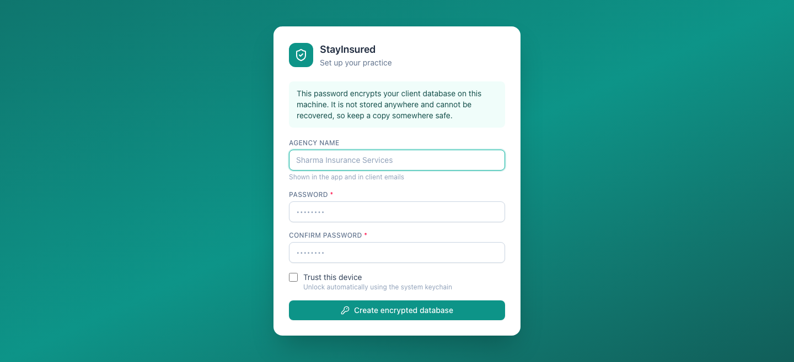
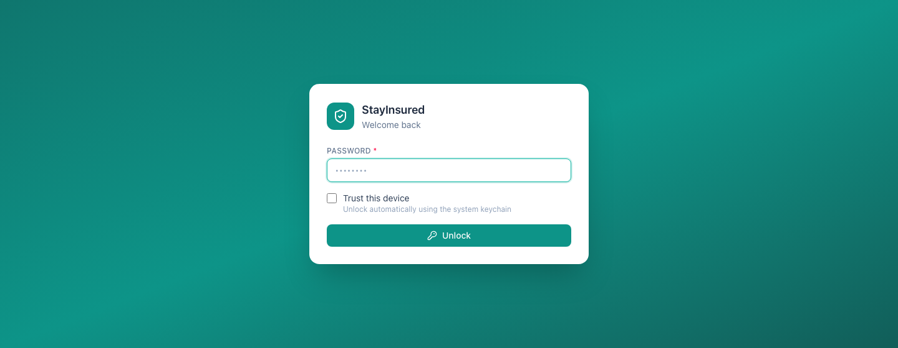

[← Guide contents](index.md)

# Install and first run

Getting StayInsured onto the machine, creating the encrypted book, and opening
and closing it safely every day.

- [Install the app](#install-the-app)
- [Create your book](#create-your-book)
- [Unlock it each day](#unlock-it-each-day)
- [Lock, close and quit](#lock-close-and-quit)

## Install the app

Download the file for your computer from the
[releases page](https://github.com/laksagent-png/StayInsured/releases).

| System | File | What to do |
| --- | --- | --- |
| macOS | `.dmg` | Open it, drag StayInsured into Applications, then **right-click the app and choose Open** the first time |
| Windows | `.exe` | Run it. When Windows says the publisher is unknown, choose **More info**, then **Run anyway** |

On macOS a double-click gives you a warning with no way past it; right-clicking
gives you an Open button. You do this once. Both warnings appear because the app
is not registered with Apple and Microsoft, and neither is a sign that anything
is wrong.

The app needs no other software. It carries its own database.

## Create your book

The first launch asks for two things: your agency name, and a password.

| Field | Required | Notes |
| --- | --- | --- |
| **Agency name** | Yes | Appears in the app and on client emails. Change it later in [Settings](settings.md) |
| **Password** | Yes | At least eight characters. This encrypts the database |
| **Confirm password** | Yes | Must match |
| **Trust this device** | No | Stores the key in the Keychain (macOS) or Credential Manager (Windows) |

Press **Create encrypted database** and the book is ready to use.

**The password is the key, and there is no reset.** It is not stored anywhere
and nobody — including you — can recover the data without it. Write it down and
keep it where you keep anything else valuable.

Tick **Trust this device** on your own machine and opening the app becomes a
single click. Leave it clear on a shared machine so the password is typed every
time. You can change your mind either way later.

## Unlock it each day

Type the password and press **Unlock**.

On a trusted device the app unlocks itself as it starts. If you dismissed that,
**Use the saved key on this device** does it again without typing anything.

Unlocking also brings every status in line with today's date, so the renewal
counts you see are the counts as of this morning.

## Lock, close and quit

| Action | What happens |
| --- | --- |
| **Lock app** at the foot of the sidebar | Closes the book and returns to the unlock screen. The app keeps running |
| Closing the window | The app keeps running in the menu bar (macOS) or system tray (Windows) |
| **Open StayInsured** in the tray menu | Brings the window back |
| **Lock now** in the tray menu | Locks without opening the window |
| **Quit StayInsured** in the tray menu | Shuts the app down properly |

Lock the app whenever you leave your desk. It takes one click and one password
to come back.

---

Next: [find your way around](getting-around.md), or go straight to
[importing your book](import-your-book.md).
