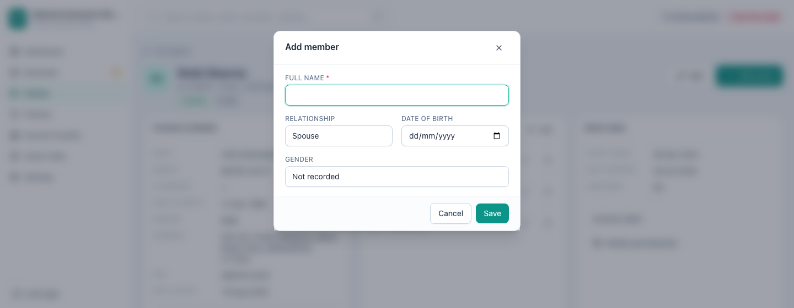

[← Guide contents](README.md)

# Record insured members

A family floater covers four people under one policy number. Members are the
four people. Record them once against the client, then tick them on whichever
policies cover them.

- [Why record members](#why-record-members)
- [Add a member](#add-a-member)
- [Attach members to a policy](#attach-members-to-a-policy)
- [Edit or remove a member](#edit-or-remove-a-member)

## Why record members

With members recorded you can answer, without opening the paperwork:

- Who exactly is covered under this floater?
- Is the son still on the policy now he has turned 25?
- Which of my clients has a parent covered, so the premium jumps at renewal?

Members belong to the client, not to a single policy. Add a child once and they
are available to every health and travel policy that client ever holds.

## Add a member

Open the client and press **Add** on the **Members covered** panel.

| Field | Required | Notes |
| --- | --- | --- |
| **Full name** | Yes | |
| **Relationship** | | Self, spouse, son, daughter, father, mother or other |
| **Date of birth** | | Tells you when a child ages out or a parent moves premium band |
| **Gender** | | |

Record the client themself as **Self** when they are covered under their own
floater. It keeps the list of lives complete.

## Attach members to a policy

The members you record appear as chips on the [policy form](policies.md). Tick
the ones this policy covers when you add or edit it.

An [imported file](import-your-book.md) with a covered-members column does this
for you: names split on commas, semicolons, slashes and pipes are created as
members and attached to that policy.

## Edit or remove a member

Click a member's name to edit them. The remove button takes them off the client
and off the policies they were attached to, after asking.

Removing a member does not change any policy's premium or sum insured. It only
changes who you have recorded as covered.

---

Next: [record their policies](policies.md).
