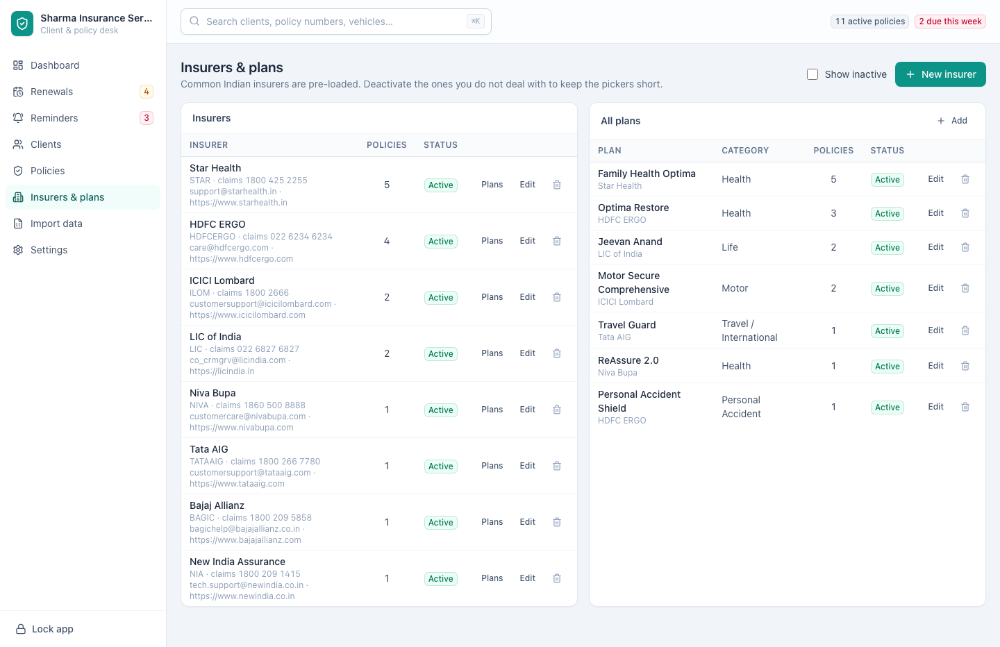
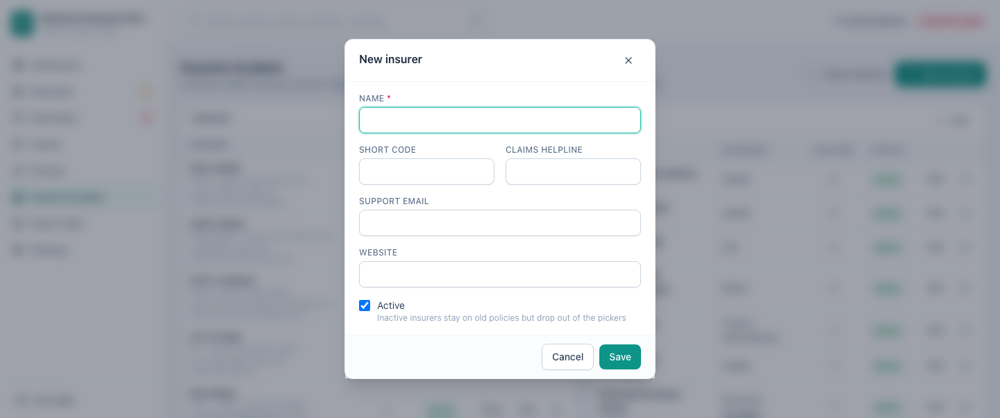

[← Guide contents](index.md)

# Insurers and plans

The **Insurers & plans** screen at `/insurers` holds the companies you place
business with and the products they sell. Keeping it clean is what stops "HDFC
Ergo" being recorded three different ways and your motor book being split across
all three.

- [The screen](#the-screen)
- [Add an insurer](#add-an-insurer)
- [Add a plan](#add-a-plan)
- [Retire an insurer or plan](#retire-an-insurer-or-plan)
- [Delete an insurer or plan](#delete-an-insurer-or-plan)

## The screen

Insurers are on the left, plans on the right. Common Indian insurers are
pre-loaded, so most agencies never add one.

An insurer's row carries its short code and claims helpline under the name, its
support email and website under that, the number of policies it holds, and
whether it is **Active** or **Inactive**. A plan's row names the company it
belongs to under its name, then its category, its policy count and the same
status.

| Control | What it does |
| --- | --- |
| **Plans** on an insurer's row | Filters the plans panel to that company, and the panel heading names it |
| **Show all** | Returns the plans panel to every company |
| **Show inactive** | Reveals retired insurers and plans |
| **Edit** | Opens the insurer or plan for changes |

A panel that cannot read its list says so where the rows would be, rather than
showing the empty state and inviting you to add companies you already have.

## Add an insurer

Press **New insurer**.

| Field | Required | Notes |
| --- | --- | --- |
| **Name** | Yes | Exactly as you want it to read on every policy |
| **Short code** | | A quick abbreviation, useful in exports |
| **Claims helpline** | | The number you look up when a client rings about a claim |
| **Support email** | | Shown on the company's row |
| **Website** | | Shown on the company's row |
| **Active** | | On by default |

Recording the claims helpline is worth the ten seconds. When a client rings
about a claim, the number is on the screen you are already on.

## Add a plan

Press **Add** on the plans panel.

| Field | Required | Notes |
| --- | --- | --- |
| **Insurer** | Yes | Which company sells it. Opens on the company the panel is filtered to |
| **Plan name** | Yes | The insurer's product name |
| **Category** | Yes | Health, life, motor and the rest |
| **Plan code** | | |
| **Active** | | On by default |

Every plan belongs to a company. Leave **Insurer** on **Choose an insurer** and
the form says **Choose the insurer this plan belongs to** and stays open.

Plans are optional. Recording them lets you see which products your book is
concentrated in, and [importing a file](import-your-book.md) that names plans
creates them for you.

## Retire an insurer or plan

Clear **Active** on either. It drops out of the pickers on new policies while
staying on every policy that already uses it, and nothing in your history
changes.

This is what you want when you stop placing business with a company. Tick **Show
inactive** to see them again — the row reads **Inactive** — and set **Active** to
bring one back. A plan goes on naming its company even after that company is
retired.

## Delete an insurer or plan

The delete button on the row removes it outright, and asks first, naming what it
is about to remove. Use it only for a duplicate you created by accident — retiring
is the right answer for a company you have stopped using.

A company that is on any policy is refused, and the refusal says how many
policies stand in the way. When one does go, its plans go with it, because a
plan cannot outlive the company that sells it.

---

Next: [settings](settings.md).
