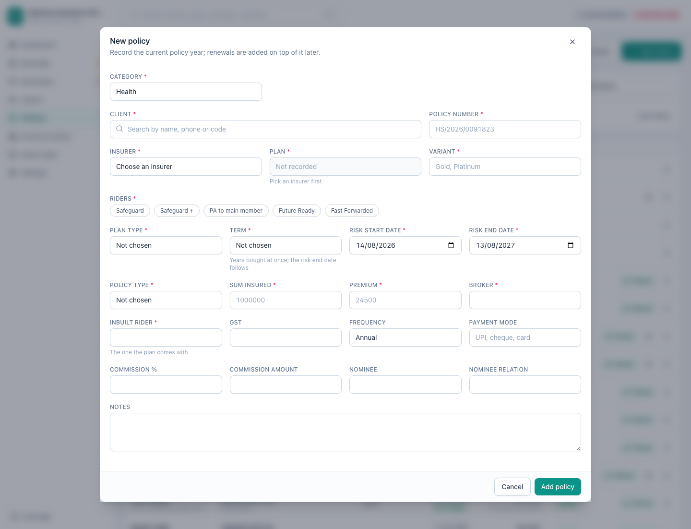
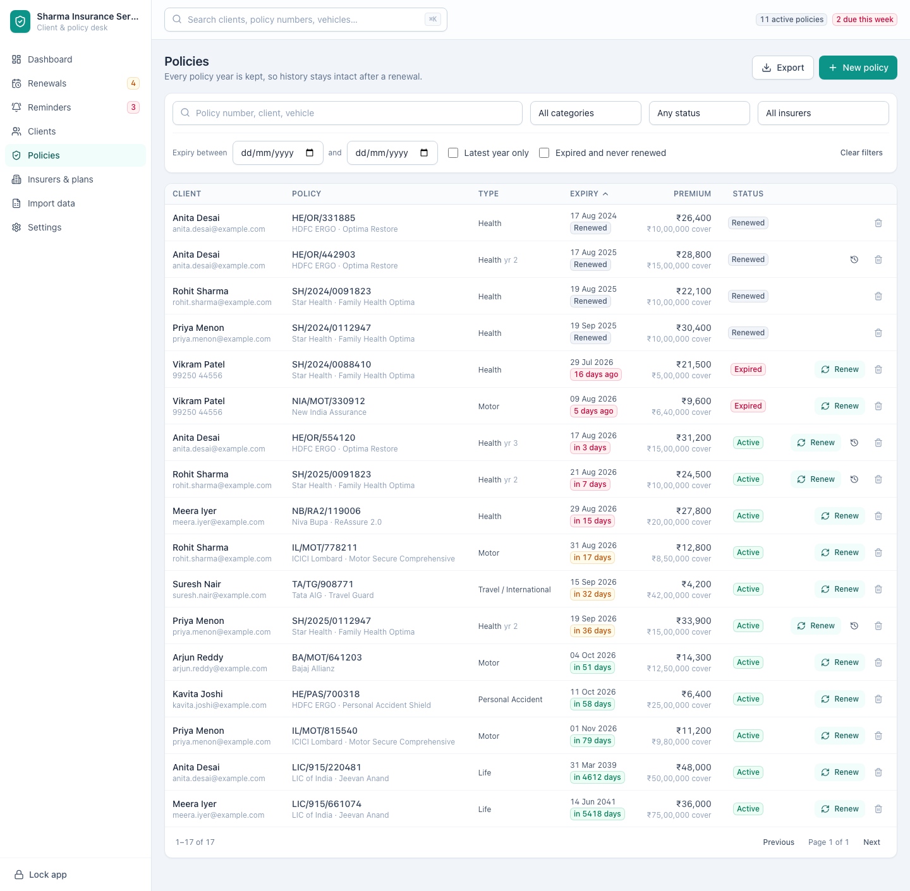

[← Guide contents](index.md)

# Manage policies

Every policy year you have placed sits on the **Policies** screen at
`/policies`. Renewing is on its [own page](renewals.md); this one covers
recording, finding and correcting policies.

- [Record a policy](#record-a-policy)
- [Every field on the policy form](#every-field-on-the-policy-form)
- [Find a policy](#find-a-policy)
- [What the statuses mean](#what-the-statuses-mean)
- [Edit a policy](#edit-a-policy)
- [Delete a policy](#delete-a-policy)
- [Export the list](#export-the-list)

## Record a policy

Press **New policy**, or **Add policy** on a client's page to skip choosing the
client.

Client, policy number, insurer, category, start date and expiry date are
required. Everything else earns its place: fill in premium and commission and
the app can tell you what the book is worth.

Press **Add policy** at the foot of the form, or press Enter from any box. The
policy appears immediately in the list, on the client's page, and — once it
comes within range — on the [renewals desk](renewals.md). The one box where
Enter does something else is the client search: there it takes the closest
match, so you can find the client and carry on without reaching for the mouse.
**Cancel**, the corner cross and the Escape key all close the form without
saving.

One client holds as many policies as they need. Each carries its own number,
insurer, premium and expiry date, and each falls due in its own time.

## Every field on the policy form

| Field | Required | Notes |
| --- | --- | --- |
| **Client** | Yes | Type to search the book. Pre-filled when you start from a client's page |
| **Policy number** | Yes | Searchable from anywhere in the app |
| **Insurer** | Yes | From your [insurers list](insurers-and-plans.md) |
| **Plan** | | The insurer's product. Pick the insurer first |
| **Category** | Yes | Health, life, motor and the rest — see [categories](reference.md#categories) |
| **Start date** | Yes | Starts on today for a new policy |
| **Expiry date** | Yes | Fills itself in one year less a day after the start date. Overwrite it when the insurer says otherwise |
| **Sum insured** | | |
| **Premium** | | The gross premium |
| **GST** | | |
| **Frequency** | | Annual, half-yearly, quarterly, monthly or single |
| **Commission %** | | |
| **Commission amount** | | Worked out from the premium and rate unless you type your own |
| **Payment mode** | | |
| **Nominee** | | |
| **Nominee relation** | | |
| **Vehicle number** | | Appears for motor policies only |
| **Members covered** | | The [members](insured-members.md) on this client, as chips to tick |
| **Status** | | Only when editing an existing policy — see [statuses](#what-the-statuses-mean) |
| **Notes** | | |

Two fields fill themselves in and then get out of the way: **Expiry date**
follows the start date, and **Commission amount** follows the premium and rate.
Type over either one and your value stands.

The form checks the entry before anything is written, and says what is wrong in
the dialog while keeping every box as you left it:

- A client, an insurer and a policy number are named before it will save.
- Both dates are needed, and the expiry has to come after the start.
- Money boxes take figures only. Letters typed into a premium never land, and a
  negative sum insured, premium, GST or commission is refused.
- A commission rate is a share of the premium, so it lies between 0 and 100.

An empty money box and a nil one mean different things. Leave the premium blank
and the policy is recorded as not knowing it; type `0` and it is recorded as
costing nothing.

## Find a policy

| Control | What it does |
| --- | --- |
| Search box | Matches policy number, client name or vehicle number |
| **All categories** | One kind of cover |
| **Any status** | Active, expired, lapsed, renewed or cancelled |
| **All insurers** | One company |
| **Expiry between** | Any window of dates you like |
| **Latest year only** | Hides superseded years, leaving the current picture |
| **Expired and never renewed** | The chase list: cover has stopped and nothing replaced it |
| **Clear filters** | Resets the screen |

The two switches answer the questions you ask most. **Latest year only** is how
you count the book without counting the same cover four times. **Expired and
never renewed** is who to call.

The search box at the top of the app searches the same three things from
wherever you are — press **⌘K** or **Ctrl+K**.

Filters that exclude everything say **No policies match**; a book with nothing
in it yet says **No policies yet**. A list the book could not read says so and
offers **Try again**, so a failure is never mistaken for a quiet week.

## What the statuses mean

Four of the five follow the calendar rather than being typed in. They are
brought up to date every time you unlock the app, and on demand with
**Recalculate** on the [renewals desk](renewals.md).

| Status | Set when |
| --- | --- |
| **Active** | The expiry date is today or later |
| **Expired** | The expiry date has passed within the last 30 days and nothing has replaced it |
| **Lapsed** | The expiry date passed more than 30 days ago and nothing has replaced it |
| **Renewed** | A later policy year exists in the chain |
| **Cancelled** | You ended it early. This is the one you set yourself |

Correcting an expiry date to a future date makes the policy active again, so a
typo costs you nothing.

**Cancelled is set from the policy itself.** Click the row to open that policy
year, set **Status** to *Cancelled*, and press **Save changes**. The box offers
*Active* and *Cancelled* and nothing else, because expired, lapsed and renewed
are answers the app works out from the dates and the chain — a year already
carrying one of those shows it in the box, greyed, until you choose one of the
two. A cancelled year then stays quiet however close its expiry date: it appears
on no tab of the [renewals desk](renewals.md), no reminder is written about it,
and **Recalculate** leaves it alone, because cancelling is a decision you made
and the calendar does not get to overrule it.

**Renew** stays on a cancelled row all the same. Cancelling ends a year early; it
does not decide the client has gone. The desk never lists a cancelled policy, so
its row is the only place left to write next year from when the client comes
back — see [record a renewal](renewals.md#record-a-renewal).

**A cancelled year stays cancelled after it is renewed.** Every other year a
renewal replaces is marked **Renewed**, but a cancellation is something you and
the client did, and the book keeps saying so: a year that reads *Cancelled* two
renewals later is still telling you the cover was ended early that year. The new
year is on record just the same, so the cancelled one leaves the desk and does
not offer **Renew** a second time.

## Edit a policy

Click any row to open that policy year and change it. **Save changes** commits.

**Editing changes that year alone.** When the insurer issues next year's policy,
[record a renewal](renewals.md#record-a-renewal) instead — that writes the new
year and keeps this one on record. Editing this year's premium to next year's
number destroys the history you are keeping.

## Delete a policy

The delete button at the end of a row removes a single policy year after asking,
naming the policy number it is about to remove. Use it for a record entered
twice or entered wrongly.

Deleting a year out of the middle of a chain leaves the years either side
intact.

## Export the list

**Export** saves whatever the filters currently show as Excel or CSV — the
motor book, this quarter's expiries, everything with one insurer.

---

Next: [work the renewals](renewals.md).
