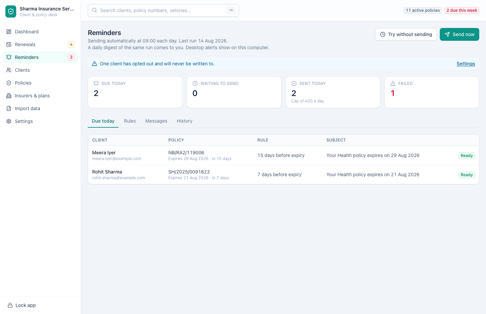
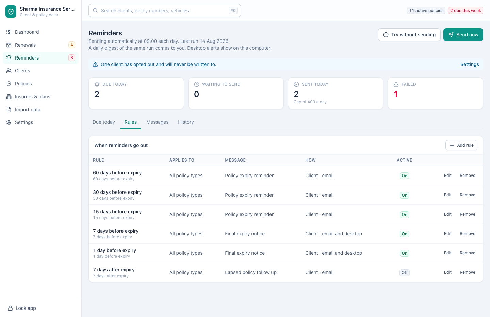
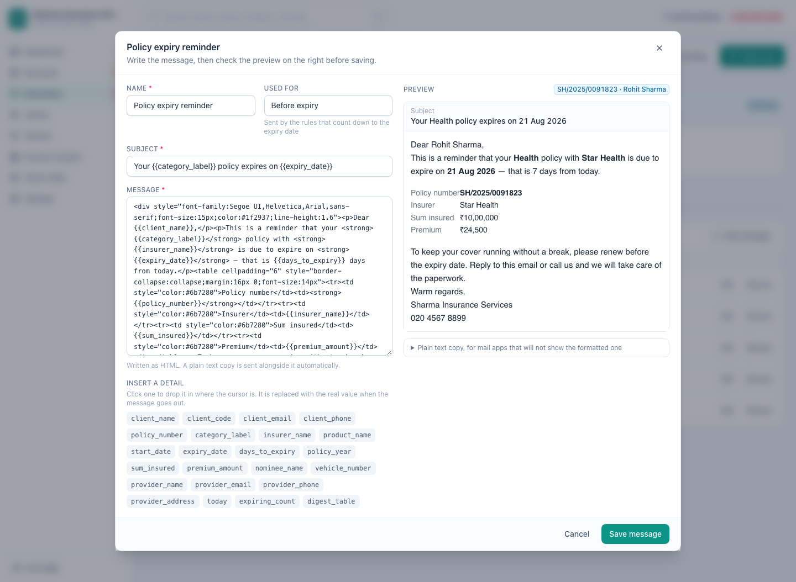
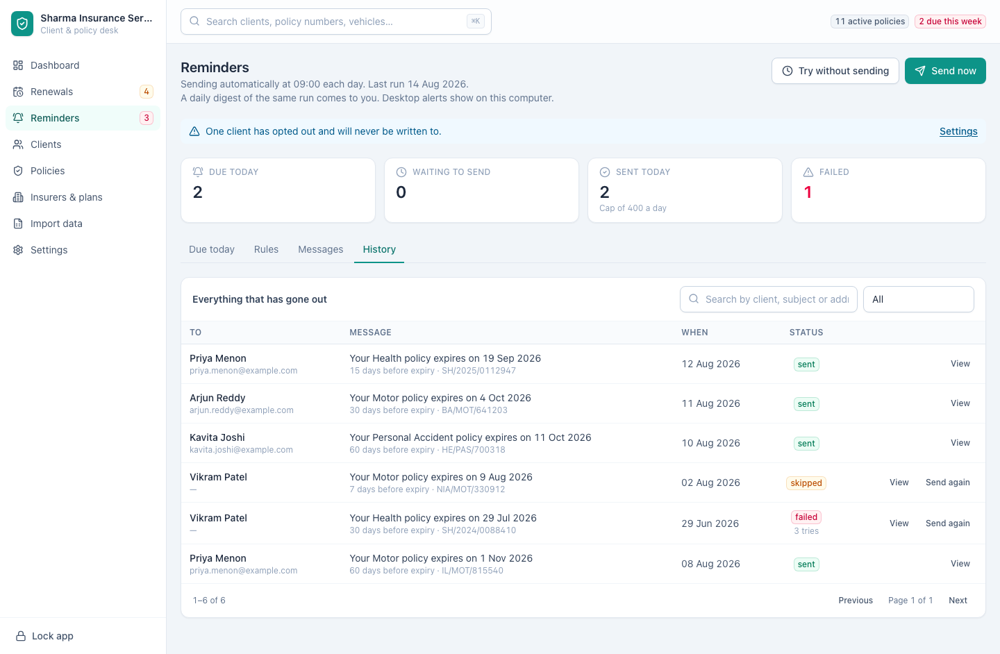

[← Guide contents](index.md)

# Send the reminders

Reminders at `/reminders` write to clients before their cover stops, from your
own mailbox, without you opening the list. A rule decides when; a message
decides what it says; the daily run does it.

- [Before anything is sent](#before-anything-is-sent)
- [The screen](#the-screen)
- [Due today](#due-today)
- [Rules: when reminders go out](#rules-when-reminders-go-out)
- [Messages: what they say](#messages-what-they-say)
- [History: what happened](#history-what-happened)
- [Trying it before trusting it](#trying-it-before-trusting-it)
- [Who never gets written to](#who-never-gets-written-to)
- [A routine that works](#a-routine-that-works)

## Before anything is sent

Two things are needed, both in [Settings](settings.md#sending-email): your mail
server, and the switch that turns the daily run on. Until the mail server is
there, the screen says so and **Send now** stays disabled.

Reminders leave from your own mailbox rather than from us. Replies come back to
you, the address the client sees is yours, and no third party ever holds your
client list.

## The screen

The line under the title says whether sending is automatic and when the last run
happened, and the line after it says whether your daily digest and the desktop
alerts are switched on. Four figures sit above the tabs.

| Figure | Means |
| --- | --- |
| **Due today** | Reminders a rule matches today that have not been recorded yet |
| **Waiting to send** | Written to the outbox, not yet delivered — usually the daily cap |
| **Sent today** | Delivered since midnight, against the cap |
| **Failed** | Tried three times and given up. These need you |

Anything standing between you and a working reminder is spelled out above the
figures: no mail server, no saved password, practice mode still on, clients with
no email address, clients who have opted out. Each notice carries a link to
[Settings](settings.md) beside it.

When the day's figures cannot be read at all, **The day's figures could not be
read** stands under the heading with a **Try again** button, so it is clear the
book refused rather than that the day is empty. Each tab says the same for
itself.

## Due today

The first tab lists exactly what the next run will do, worked out fresh — it
writes nothing and sends nothing.

Each row names the client, the policy and the rule that matched, and shows the
subject line the client will see. A row marked **Ready** will go. A row with an
amber note will not, and the note says why.

A reminder appears here only once per policy year. Once it has been recorded —
sent, skipped or failed — that rule is done with that policy until it renews.

## Rules: when reminders go out

A rule is a point in a policy's year and a message to send when it arrives. The
ladder is set up for you: 60, 30, 15, 7 and 1 days before expiry, plus one for a
week after expiry that starts switched off. The list is ordered by timing,
furthest ahead of expiry first, so a rule you add sits where its own timing puts
it. Where two rules fall on the same day, the place each was given decides which
of them reads first, and a rule added without one goes after the rest.

Press **Add rule**, or **Edit** on a row.

| Field | Does |
| --- | --- |
| **Name** | How the rule reads here and in history |
| **Days** and **Counted** | The point in the year: so many days before or after expiry, up to a year either side |
| **Applies to** | Every policy type, or just one — a motor-only wording, for instance |
| **Goes to** | The client, or you |
| **How** | Email, a desktop notification, or both |
| **Message** | Which message it sends. Write them under **Messages** |
| **Active** | An inactive rule stays in the list and sends nothing |

A rule that goes to the client has to have a message: leave **Message** unset and
the form says **Choose the message this rule sends to the client** and stays
open. A rule that only notifies you can go without one.

Press the **On** or **Off** badge in the list to switch a rule without opening
it. **Remove** asks first, then deletes the rule and keeps the history of what it
sent.

A rule fires on the day the policy is exactly that far from expiry — a 30-day
rule catches a policy on the day it has 30 days left, not every day after.
Nothing is sent for a policy that has already been renewed.

## Messages: what they say

Five messages come with the app, and the expiry reminder is the one most rules
use. The list names each one with its subject line and how many rules send it.
Press **Edit** to change the wording, or **New message** to write another.

Type the message on the left, read it on the right. **Used for** says which part
of the year the message belongs to, and the note under it explains what sends it.
The preview is rendered against a real policy from your own book, so you are
reading what a client would read rather than a page of braces.

Every message needs a subject, since a message without one arrives as a blank
line in the client's inbox. Leave it empty and **Subject is required** appears
under the box and the cursor lands there.

**Insert a detail** puts a placeholder where the cursor is: `{{client_name}}`,
`{{expiry_date}}`, `{{premium_amount}}` and the rest. Each is replaced with that
client's real value as the message goes out. Hover one to see what it holds.

If you type a name that nothing fills, an amber line above the preview says so —
that placeholder would arrive as a gap in the client's inbox.

The message is written as HTML, so you can style it. A plain text copy is built
and sent alongside it automatically, for mail apps that will not show the
formatted one; it is at the bottom of the preview.

**Remove** refuses while a rule still sends the message. Point the rule at
another one first.

## History: what happened

Every message is recorded, whether it went or not. The search box above the log
finds one by client, subject or address, **Status** narrows it to one kind, and
**When** at the top of the column orders the log by date — press it again to turn
the order around. Twenty-five rows show at a time.

| Status | Means |
| --- | --- |
| **Sent** | Delivered to the mail server |
| **Waiting** | In the outbox for the next run, usually behind the daily cap. The row itself reads `queued` |
| **Failed** | Three attempts, all refused. The row counts the tries and **View** has the reason |
| **Skipped** | Never attempted — no email address, or the client opted out |
| **Cancelled** | Stopped before sending, usually because the policy was renewed |

**View** shows the rule, the policy, the dates, how many attempts were made and
the reason the last one failed. **Send again** puts a failed or skipped message
back in the queue. **Cancel** stops one that is still waiting.

A message that cannot be delivered is retried on the next two runs before it is
marked failed, so a mail server having a bad hour costs nothing.

## Trying it before trusting it

Nobody should point an unattended mailer at their client book on the first day.

1. Leave **Practice mode** on in [Settings](settings.md#reminders). The daily
   run works everything out and sends nothing.
2. Read **Due today** for a few days and check the list is the one you would
   have written by hand.
3. Use **Send test** in Settings to send yourself one message and confirm it
   arrives and looks right.
4. Press **Try without sending** to see the whole run reported without a single
   message leaving.
5. Turn practice mode off, and set the daily cap low for the first week.

**Send now** runs the day's batch immediately, for when you want it out before
the scheduled time. It says how many clients that is and waits for you to agree
before anything leaves.

## Who never gets written to

| Never sent to | Why |
| --- | --- |
| Clients with **Do not send reminders** ticked | Their choice, recorded on the client |
| Clients with no email address | Nothing to send to. Fix from [Missing email](clients.md#find-a-client) |
| Archived clients | Not part of the working book |
| Policies already renewed | The next year is on record, so there is nothing to chase |

Each of these is recorded once, with the reason, and then left alone. The same
client is not raised again tomorrow.

## A routine that works

1. Leave the app running in the menu bar. The run happens at the time you set
   even with the window closed, and catches up if the machine was asleep.
2. Read the digest that arrives in your inbox each morning.
3. Open **Reminders** and clear **Failed** — those are the clients who did not
   hear from you.
4. Work the [renewals desk](renewals.md) for the calls. Reminders handle the
   writing; they do not handle the talking.

---

Next: [keep insurers and plans tidy](insurers-and-plans.md).
