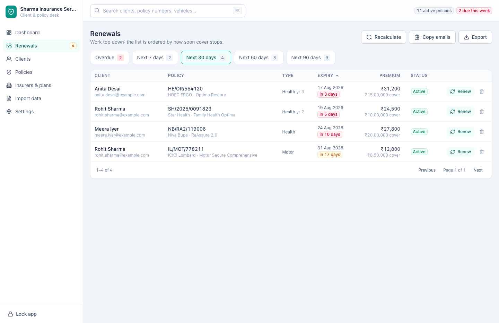
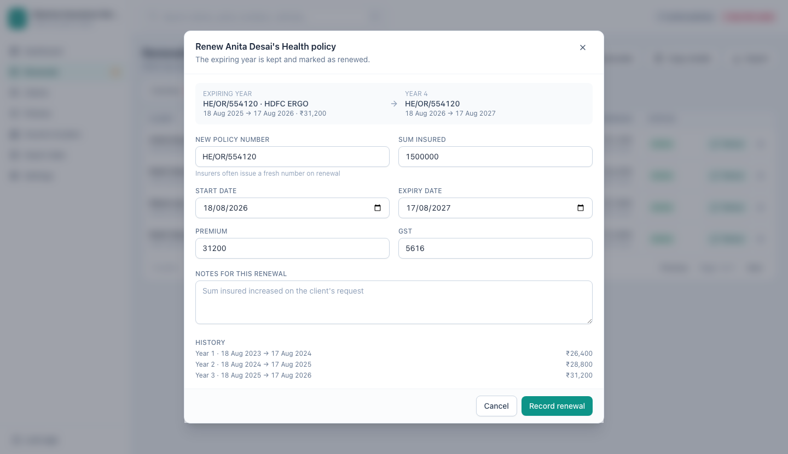
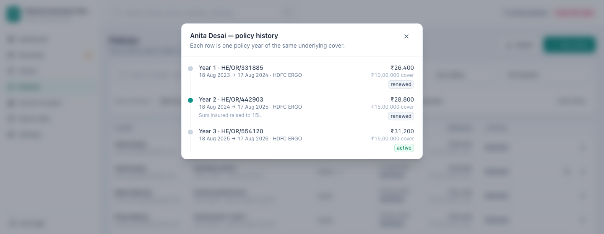

[← Guide contents](README.md)

# Work the renewals

The renewals desk at `/renewals` is where the day's work is. It puts every
policy in front of you in the order cover stops, and turns a renewal into one
dialog.

- [The desk](#the-desk)
- [Recalculate](#recalculate)
- [Copy emails](#copy-emails)
- [Export the list](#export-the-list)
- [Record a renewal](#record-a-renewal)
- [Read the history](#read-the-history)
- [A renewal routine that works](#a-renewal-routine-that-works)

## The desk

Policies are grouped by how soon cover stops. Each tab carries its own count, so
the shape of the week is visible before you click anything.

| Tab | Holds |
| --- | --- |
| **Overdue** | Cover that has already stopped with nothing replacing it |
| **Next 7 days** | Active policies expiring within a week |
| **Next 30 days** | Active policies expiring within a month — where the screen opens |
| **Next 60 days** | Active policies expiring within two months |
| **Next 90 days** | Active policies expiring within three months |

Each list is ordered by urgency, so work down from the top. Sort by any column
heading when you would rather group by insurer or by premium.

The badge on the sidebar counts the 30-day tab, which is the number to clear.

## Recalculate

**Recalculate** rechecks every policy against today's date and moves statuses
on: active to expired, expired to lapsed, and back to active if you have
corrected an expiry date.

This happens on its own every time you unlock the app. Press it when you have
left the app open overnight and want the counts to mean today.

## Copy emails

**Copy emails** puts the email addresses from the tab you are looking at on the
clipboard, ready to paste into the To field of your mail program. A toast tells
you how many were copied.

| Rule | Effect |
| --- | --- |
| Clients with no email address | Left out — fix them from [Missing email](clients.md#find-a-client) |
| Clients with **Do not send reminders** ticked | Left out, always |
| The same client on two expiring policies | Copied once |
| Very long lists | Up to 500 addresses in one go |

This is how renewal chasing works today. Automatic sending is not switched on —
see [Settings](settings.md#reminders).

## Export the list

**Export** saves the tab you are looking at as Excel or CSV, with client name,
contact details, insurer, premium and expiry date. Useful for a call sheet, or
for handing the week's chase list to someone else.

## Record a renewal

Press **Renew** on the row.

Last year's details are already in the form and the dates run on from the
expiring year. Change what the insurer changed.

| Field | Pre-filled with | Notes |
| --- | --- | --- |
| **New policy number** | Last year's number | Insurers often issue a fresh one |
| **Sum insured** | Last year's cover | |
| **Start date** | The day after the expiring policy ends | |
| **Expiry date** | One year less a day after the new start date | |
| **Premium** | Last year's premium | Tells you how far you have moved from last year as you type |
| **GST** | Last year's GST | |
| **Notes for this renewal** | Empty | What changed, and why |

Press **Record renewal**. The dialog closes, the row leaves the tab, and the new
year takes its place on the list.

**Renewing never overwrites last year.** It writes the new policy year, marks
the expiring one **Renewed**, and links the two, so what the client paid each
year stays on record. That is the difference between a book you can quote from
and a spreadsheet that only knows today.

## Read the history

On the **Policies** screen, press the history button on any policy past its
first year.

Each row is one year of the same underlying cover: the number it carried that
year, the dates it ran between, the premium and the sum insured. Read down the
premium column and you have the client's renewal story in one look — which is
the argument you need when this year's premium goes up.

## A renewal routine that works

1. Open **Renewals** in the morning and press **Recalculate**.
2. Clear **Overdue** first. Cover has already stopped for these people.
3. Work **Next 7 days**, then **Next 30 days**.
4. **Copy emails** on the tab and send the batch, then call the ones who matter.
5. As each renewal is confirmed, press **Renew** and record it while it is in
   front of you.

---

Next: [keep insurers and plans tidy](insurers-and-plans.md).
