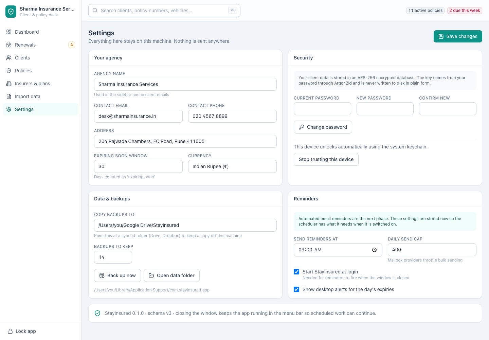

[← Guide contents](index.md)

# Settings

Your agency details, your password, and the preferences that shape the rest of
the app, at `/settings`. Backups have [their own page](backups-and-data.md).

- [Saving changes](#saving-changes)
- [Your agency](#your-agency)
- [Change your password](#change-your-password)
- [Stop trusting this device](#stop-trusting-this-device)
- [Reminders](#reminders)

## Saving changes

**Save changes** at the top right commits the whole screen. Make all your edits,
then save once.

Nothing on this screen leaves your machine.

## Your agency

| Field | What it affects |
| --- | --- |
| **Agency name** | The sidebar and the signature on client emails |
| **Contact email** | Client emails |
| **Contact phone** | Client emails |
| **Address** | Client emails |
| **Expiring soon window** | How many days ahead count as "expiring soon" on the dashboard |
| **Currency** | How amounts are shown across the app |

Set **Expiring soon window** to how far ahead you actually start chasing. Thirty
days suits most agencies; set it to 45 if you work further out, and the
dashboard follows you.

## Change your password

Enter **Current password**, then the new one in **New password** and **Confirm
new**, and press **Change password**.

The database is re-encrypted as part of this, so the app is busy for a moment.
Do it when you are not mid-month-end.

The new password is the only key from then on. There is still no reset, so write
it down before you change it.

## Stop trusting this device

**Stop trusting this device** removes the key held in the Keychain (macOS) or
Credential Manager (Windows). The app asks for the password next time it opens.

Press it before handing the machine to anyone — a repair shop, a colleague, or
a buyer.

Tick **Trust this device** on the unlock screen to set it up again.

## Reminders

Reminders are not sent automatically yet. The [renewals desk](renewals.md) and
its **Copy emails** button are how you chase renewals today, and they take
seconds.

The settings on this card are held ready for when sending is switched on:

| Setting | Meaning |
| --- | --- |
| **Send reminders at** | The time of day the sweep will run |
| **Daily send cap** | How many to send in a day, because mailbox providers throttle bulk sending |
| **Start StayInsured at login** | Needed for reminders to fire when the window is closed |
| **Show desktop alerts for the day's expiries** | A notification when policies expire that day |

Fill them in now and they are used the moment sending is available.

---

Next: [backups and your data](backups-and-data.md).
