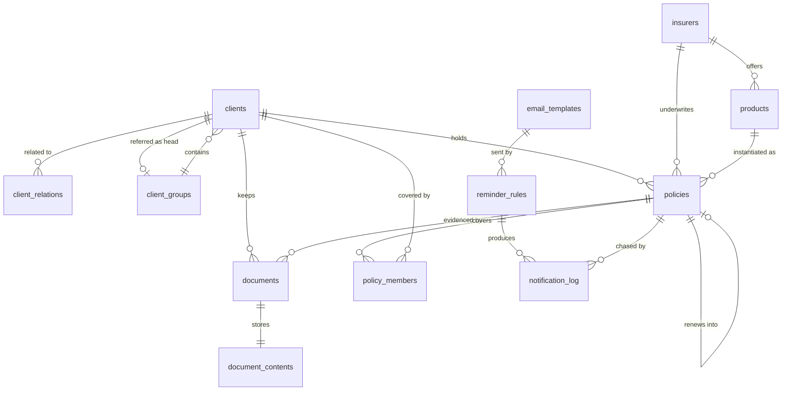

# Data model

The schema lives in `src-tauri/src/db/schema/`, applied by
`src-tauri/src/db/migrations.rs`. Everything below is one encrypted SQLite
database, `stayinsured.db`, opened through SQLCipher.

Current schema version: **7** — `001_init.sql` (structure), `002_seed.sql`
(defaults), `003_documents.sql` (stored files), `004_search_index.sql` (the
client search triggers, and a rebuild of the index behind them),
`005_client_relations.sql` (family members as clients),
`006_health_details.sql` (what a health proposal asks for) and
`007_client_groups.sql` (corporate clients, and the groups they sit in).
`session_state.schemaVersion` reports it at runtime.

## Migration policy

`MIGRATIONS` is an ordered list of `(version, sql)` compiled in with
`include_str!` and tracked in `PRAGMA user_version`. All pending steps run inside
one transaction when the database is opened.

**A shipped migration is never edited.** Users have already applied it, and
editing it changes nothing on their machine while silently diverging from the
schema fresh installs get. Any change is a new numbered file added to the list.

## Entities in use

### `clients`

The client book, and the only table that holds a client of any sort. A spouse on
a floater, a dependent child, a policyholder and a company buying group health
for its staff are all rows here; what separates them is whether a policy is
written against the row, not which table they live in.

`client_code` is unique and allocated as `CL-00001` upward from the highest
numeric suffix matching `CL-[0-9]*`.

Contact and identity: `full_name` (required), `email`, `phone`, `alt_phone`,
`date_of_birth`, `gender`, `address_line1`, `address_line2`, `city`, `state`,
`pincode`, `occupation`, `pan`, `gstin`. Behaviour: `preferred_language`
(default `en`), `reminders_opted_out`, `notes`, `is_archived`.

`kind` is `individual` or `company`, defaulting to `individual` so that every
client entered before companies existed is one. A company has no `date_of_birth`
and no `gender`; what it has instead is `contact_person` and
`contact_designation` — the human who answers the phone, who is not the entity on
the policy — and `registration_no` for the CIN or LLPIN. `pan` and `gstin` were
already here and mean the same thing for a company as for a person, and
`occupation` carries the industry.

`group_id` is the group this client sits in, `ON DELETE SET NULL`. It is written
only by `set_client_group`; `clients::update` coalesces it, so a client form that
draws no group cannot empty one by saving a name change.

Names are title-cased, phones reduced to digits with an optional leading `+`, PAN,
GSTIN and the registration number upper-cased, and blank text stored as `NULL`.
Indexed on name, email, phone, city, archived state, kind and group.

### `client_groups`

A named set of clients the agency works as one book, and the client who referred
them. `group_code` is unique and allocated as `GR-00001` upward the way client
codes are; `name` is unique; `head_client_id` is the referrer, `ON DELETE SET
NULL`; plus `notes`, `is_archived` and timestamps maintained by
`client_groups_touch`.

**A group is a row and a family is not, and that is not an inconsistency.** A
family has no boundary — it is whoever the relationship edges reach, a person is
in several at once, and nothing may choose between them, which is why
`client_relations` has no container and why the family archive stops one step out.
A group has exactly the boundary a family lacks: it is named, entered
deliberately, holds a client at a time, and the operator can say where it ends.
Having that boundary is what lets a group be listed, summed, archived and deleted
as itself.

**Headship and membership are separate columns.** The referrer is whoever
introduced the group, and they need not be in the group they brought in — an
introducer who placed ten firms is nobody's subsidiary. So the rollups sum the
members, the group archive moves the members, and the referrer is left where they
are in both cases.

Both links let go rather than cascade, which is the opposite of
`client_relations`, where the edge dies with either person because an edge between
two people is nothing once one of them is gone. A group is a filing arrangement:
deleting the folder must not delete the companies, and losing the referrer must
not lose the group.

### `client_relations`

How one client is related to another: `(client_id, related_client_id,
relationship)`, primary key on the pair, both sides cascading on delete.

A row reads **"`related_client_id` is the `relationship` of `client_id`"** —
`(Rajesh, Aarav, 'son')` means Aarav is Rajesh's son. Only one direction is
stored per pair; the reverse is derived when a family is displayed, so there is
no second row that can fall out of agreement with the first.

Two `CHECK`s carry the design. `client_id <> related_client_id` because a client
does not relate to themselves — the `self` relationship the member table needed
has no meaning once the member *is* the client. The relationship vocabulary is
`spouse | son | daughter | father | mother | brother | sister | other`.

A family is therefore a graph over the client book rather than a list hanging off
one row, and it extends to any depth: a client's son has his own relations, and
reaching them is a walk over these edges in both directions rather than a second
kind of lookup.

Nothing marks a client as a dependent. That a person is one is derived — they
hold no policy of their own and appear as some other client's
`related_client_id` — so a dependent who buys their own cover stops being one
without anything needing to be corrected.

### `insurers`

Insurance companies. `name` is unique, `short_code` is upper-cased and used for
import matching, plus `website`, `claim_helpline`, `support_email`, `notes` and
`is_active`. Twenty-five Indian insurers are seeded so the first policy can be
entered without setup.

### `products`

Plans an insurer offers. Unique on `(insurer_id, name)`, carries a `category`
from the category domain, and cascades on insurer delete.

### `policies`

One row per **policy year**, not per policy.

| Column group | Columns |
| --- | --- |
| Chain | `chain_id`, `policy_year`, `previous_policy_id` |
| Identity | `policy_number`, `client_id`, `insurer_id`, `product_id`, `category` |
| Lifecycle | `status`, `start_date`, `expiry_date` |
| Money | `sum_insured`, `premium_amount`, `gst_amount`, `premium_frequency`, `payment_mode`, `next_due_date`, `commission_rate`, `commission_expected` |
| Detail | `nominee_name`, `nominee_relation`, `vehicle_number`, `notes` |
| Health | `variant`, `riders`, `plan_type`, `term`, `policy_type`, `broker`, `inbuilt_rider` |

Constraints: `UNIQUE (insurer_id, policy_number)`; `client_id` cascades on
delete; `insurer_id` is restricted; `product_id` and `previous_policy_id` are set
to `NULL` when their target goes. Indexed on client, expiry, status, chain,
category, insurer and previous policy.

The health columns describe one policy year the way the insurer's proposal form
asks for it, and they sit here rather than in a table beside `policies` for the
reason `vehicle_number` does: a side table would be a second row under the same
key, joined on every read, holding one row per health policy and none for
anything else.

Every one of them is nullable and stays nullable. An imported book knows none of
them, and every other category leaves them empty. The add-policy screen requires
them of a health policy; the core only checks that what it is given is a word it
knows. `policies.rs` refusing a blank health field would lose the policy rather
than the detail, and an import reaches that code without passing a screen.

`riders` is the one list: a comma-separated string in `util::RIDERS` order,
written by `util::canonical_riders` and split again by `Policy::from_row`, so
two policies carrying the same riders hold the same text whatever order they were
chosen in. Five known words per policy year, never filtered or counted on, do not
earn a table — where `policy_members` is one because a member is a client with a
life of their own.

`policy_type` is not `status`. A year ported in from another insurer is
`portability` for as long as it exists; `renewed` is a status and means a later
year of the chain is in the book. Renewing writes `renewal` onto the new year
whenever the year behind it had a `policy_type` at all.

### `policy_members`

Which lives a policy year covers — `(policy_id, insured_client_id)`, cascading on
both sides, indexed on the client so that "which policies cover this person" is
answerable from either end.

The policyholder may appear in their own policy's cover list, and on a floater
normally does. Indexing on `insured_client_id` is what lets a family be drawn
with each person's cover beside them without a query per row.

### `documents` and `document_contents`

Scans and paperwork, held **inside** the encrypted database rather than beside
it. `documents` carries `client_id` (cascading), an optional `policy_id` set to
`NULL` when the policy goes, `title`, `file_name`, `mime_type`, `size_bytes`,
`sha256` and `uploaded_at`. `document_contents` holds the bytes, one row per
document, cascading on delete.

The split is not decorative. SQLite packs the beginning of a blob into the row's
own page, so a listing that shared a table with the file bytes would page through
megabytes of scan to read a column of titles.

`UNIQUE (client_id, sha256)` makes attaching the same file to one client twice a
`conflict`. Across clients it is a shared form, and stays allowed.

## Domains

| Domain | Values | Enforced by |
| --- | --- | --- |
| Category | `health`, `life`, `motor`, `travel`, `home`, `personal_accident`, `critical_illness`, `other` | `CHECK` on `products` and `policies` |
| Policy status | `active`, `expired`, `renewed`, `lapsed`, `cancelled` | `CHECK` on `policies` |
| Premium frequency | `annual`, `half_yearly`, `quarterly`, `monthly`, `single` | `CHECK` on `policies` |
| Rider | `safeguard`, `safeguard_plus`, `pa_main_member`, `future_ready`, `fast_forwarded` | `util::RIDERS`, checked in `repo/policies.rs` |
| Plan type | `individual`, `family_floater` | `CHECK` on `policies`, and `util::PLAN_TYPES` |
| Policy type | `fresh`, `portability`, `renewal` | `CHECK` on `policies`, and `util::POLICY_TYPES` |
| Term | 1 to 5 years | `CHECK` on `policies`, and `util::MAX_TERM` |
| Relationship | `spouse`, `son`, `daughter`, `father`, `mother`, `brother`, `sister`, `other` | `CHECK` on `client_relations` |
| Client kind | `individual`, `company` | `CHECK` on `clients` |
| Gender | `male`, `female`, `other` | `CHECK` on `clients` |
| User role | `owner`, `staff`, `readonly` | `CHECK` on `users` |

Dates are ISO `YYYY-MM-DD` text. Timestamps are `datetime('now')`, so UTC.
Booleans are `INTEGER` 0/1. Money is `REAL`.

## Invariants

These hold across the whole database and the code depends on them.

1. **A policy year is never mutated by a renewal.** Renewing inserts a new row
   with the same `chain_id`, `policy_year + 1` and `previous_policy_id` pointing
   at the year it replaces.
2. **A chain has exactly one head.** The current year is the row in the chain
   with no successor — which is what `is_renewed = 0` means. `policies::renew`
   refuses a year that already has one, so a chain cannot fork into two open
   years; before that guard existed, only the interface's own buttons kept it
   from happening.
3. **Status is derived, except `cancelled`.** `sync_statuses` recalculates
   `active`, `expired`, `renewed` and `lapsed` from today's date and chain
   position on every unlock, after every real import, and on demand.
   `cancelled` is only ever set by hand and is never overwritten — including by
   a renewal, which marks the year it replaces `renewed` unless that year was
   cancelled. A cancelled year that has been renewed is still `is_renewed`, so
   it stays off the renewals desk and out of the open-year count; the status
   column is where the book remembers that the cover was ended early.
4. **A policy number is unique per insurer.** Two insurers may use the same
   number; one insurer may not. This is why a renewal needs a fresh number.
5. **A policy covers its holder or someone related to them.** Enforced by the
   insert query, not just by the UI. The relationship is what makes a person
   attachable, so putting an unrelated client on a floater means recording how
   they are related first.
6. **Deleting a client leaves their family in the book.** `client_relations`
   cascades, so the edges go and the people stay — they are clients in their own
   right, and one of them holding a policy is the ordinary case. Removing a
   family outright is a separate and explicitly chosen operation, and archiving
   is the reversible alternative the interface offers first.
7. **Deleting a group releases its clients rather than removing them.**
   `clients.group_id` is `ON DELETE SET NULL`, so emptying the filing cabinet of
   one folder does not empty it of the papers. `groups::delete` answers with how
   many it let go so the interface can say so. Deleting the referrer is the same
   shape from the other side: `head_client_id` goes to `NULL` and the group
   stands.
8. **A group archive moves its members and stops.** It needs no depth limit the
   way the family archive does, because the group row says exactly who is in it —
   which is the whole reason for keeping one. The referrer is not moved unless
   they are also a member: putting away a book somebody introduced is no reason
   to put away the person who introduced it.
9. **Group membership is not a relationship.** A group is a column on `clients`
   and never an edge in `client_relations`, so it reaches none of the family
   behaviour. A subsidiary holding no cover of its own is not a dependent and
   stays in the browse list; a company is not an insurable life on the policy of
   another company that merely shares its folder.
10. **An insurer carrying policies cannot be deleted.** Deactivation is the way to
    retire one.
11. **Blank means `NULL`.** Optional text is trimmed and empty values stored as
    `NULL`, so unique indexes and the "missing email" filter behave predictably.
12. **One rule sends to one policy year once.** `UNIQUE (rule_id, policy_id,
    policy_period)` on `notification_log`, written before the send is attempted,
    is what makes that true across restarts and repeated sweeps.
13. **Everything the agent stores lives in this one file.** A backup is a single
    `VACUUM INTO` of the database, so a scan kept beside it would be both the one
    unencrypted part of a client's record and the one part a backup leaves
    behind. This is why document bytes are a blob and not a path.

## Derived objects

### `policy_overview`

The view every grid, filter, dashboard tile and export reads. It joins policy,
client, insurer and product, and adds two computed columns:

- `days_to_expiry` — `julianday(expiry_date) - julianday(date('now','localtime'))`,
  so it is live and follows the user's local midnight.
- `is_renewed` — whether any row's `previous_policy_id` points at this one.

Reading everything through one view is what stops the dashboard and the renewals
list from disagreeing about "expiring in 30 days". `POLICY_COLUMNS` in
`models.rs` pins the column order `Policy::from_row` expects, so the two must be
edited together.

### `clients_fts`

An FTS5 external-content index over `full_name`, `email`, `phone`, `client_code`
and `pan`, tokenised with `unicode61 remove_diacritics 2`. Three triggers
(`clients_fts_ai`, `_ad`, `_au`) keep it in step with `clients`. Client search
builds a prefix query from the search terms and falls back to a `LIKE` scan when
no searchable token survives.

`_au` carries a `WHEN` clause naming those five columns, added by
`004_search_index.sql`; see the touch triggers below for why it has to. Note that
FTS5's `integrity-check` reads the index against itself and not against
`clients`, so it will pass an index that has drifted out of agreement with the
book. The tests that matter therefore assert what a search returns, not only that
the check is clean.

### Touch triggers

`clients_touch` and `policies_touch` maintain `updated_at` on update.

**A trigger on a table that has an FTS mirror must not update that table.**
`clients_touch` does exactly that, and SQLite fires the two `AFTER UPDATE ON
clients` triggers in an order it does not promise — newest first, in practice, so
the touch goes first. Its nested `UPDATE clients SET updated_at` re-enters
`clients_fts_au`, whose `old` and `new` then both hold the row as it already
stands, and the index is told to delete a row image it never held. FTS5 keeps a
per-column word count for the whole table and subtracts the deleted image from
it; when the saved row has more words in some column than the entire book has
recorded there, the count would go negative and the save is refused with
`SQLITE_CORRUPT` — "database disk image is malformed". That made editing a client
fail outright on a small book, or on any book where the column being filled in
was empty throughout (`pan`, most often), while passing unnoticed on a large one.
The `WHEN` clause on `_au` is what closes it: a touch changes no indexed column,
so it can no longer re-enter the trigger. `policies_touch` has the same shape and
is harmless only because nothing indexes `policies`; a `policies_fts` would need
the same `WHEN` clause from the start.

## Supporting tables

### `users`

One `owner` row today, holding `display_name` and an Argon2 `password_hash`
separate from the database key, plus `role`, `is_active`, `created_at` and
`last_login_at`. The role domain is already in place for staff accounts.

### `settings`

Key/value store with `updated_at`, upserted by `save_settings`. Keys and defaults
are listed in [API.md](API.md#settings-keys).

### `import_batches` and `import_errors`

Every committed import records its file name, source type, counts and the mapping
JSON used, with each reported issue in `import_errors`. Dry runs write nothing.

## Reminders

### `email_templates`

`name` (unique), `trigger`, `subject`, `body_html`, `is_active` and timestamps.
`trigger` is checked against `expiry_reminder`, `post_expiry`, `welcome`,
`renewal_confirmation`, `annual_summary`, `provider_digest`, `custom`. Bodies
hold `{{placeholders}}`; the catalogue of names lives in `templating::CATALOGUE`
rather than in the database, so the editor and the renderer cannot disagree.
Five templates are seeded.

A template cannot be deleted while a rule points at it. That is enforced in the
repository rather than by a constraint, because the message it returns names how
many rules are affected.

### `reminder_rules`

`name` (unique), `offset_days`, optional `category`, `audience`, `channel`,
`template_id`, `is_active`, `sort_order`.

**`offset_days` is counted from expiry: positive is before, negative after.**
The seeded ladder is 60, 30, 15, 7 and 1 day before, all active, plus a
seven-day-after rule that ships inactive.

`template_id` is `ON DELETE SET NULL`, and `audience` and `channel` are checked
against `client | provider` and `email | desktop | both`.

### `notification_log`

The outbox. A row is written before anything is sent, carrying `rule_id`,
`policy_id`, `client_id`, `policy_period`, `audience`, `channel`, `to_address`,
`subject`, `body_snapshot`, `status`, `attempts`, `last_error`, `scheduled_for`
and `sent_at`. `status` is checked against `queued | sent | failed | skipped |
cancelled`. Indexed on status, `scheduled_for` and policy.

**`UNIQUE (rule_id, policy_id, policy_period)` is the invariant the whole
reminder feature rests on.** `policy_period` holds the expiry date of the policy
year being chased, so the key reads "this rule, this policy, this year" and a
reminder fires exactly once per policy year however often the scheduler sweeps
or the app restarts. Queueing uses `INSERT OR IGNORE`, so the second attempt is
a no-op rather than an error.

`rule_id` is `ON DELETE SET NULL`: deleting a rule must not erase the record of
what it sent. `policy_id` and `client_id` cascade, because a deleted client's
send history has nothing left to describe.

`body_snapshot` keeps the message as it was rendered. Editing a template later
does not rewrite what a client was actually sent.

## Reserved for unbuilt features

These tables are created and no screen writes to them yet. They exist because
their shape constrains the design of what is built.

| Table | Purpose | State |
| --- | --- | --- |
| `premium_payments` | Installment schedule and receipts | Empty |
| `commissions` | Expected versus received payout | Empty; `policies` carries the summary fields the UI uses |
| `claims` | Claim intimation through settlement | Empty; documents will hang off a claim the way they hang off a policy |
| `audit_log` | Before and after JSON per change | Empty |
| `saved_views` | Named filter sets per entity | Empty |

`client_groups` was on this list and has come off it: the table, the repository,
the commands, the screens and the import and export columns are all built. A book
opened before that work still reads `clients.kind` as `individual` and
`clients.group_id` as `NULL` throughout, because nothing files a client into a
group without being asked to.
