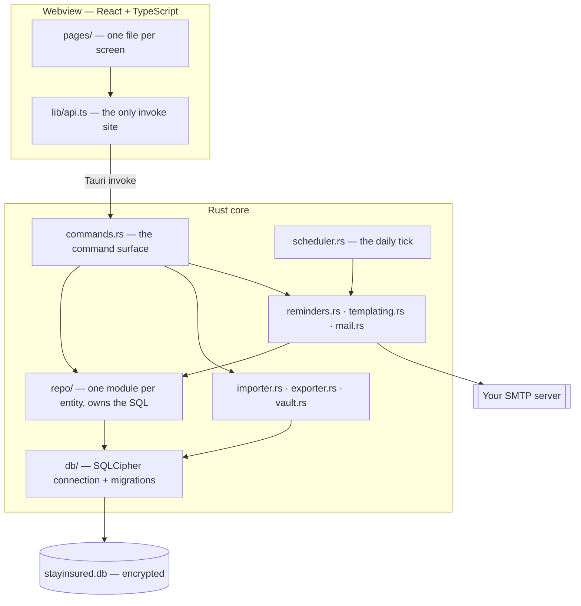
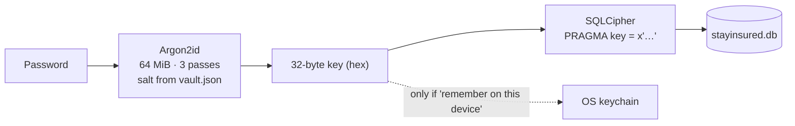
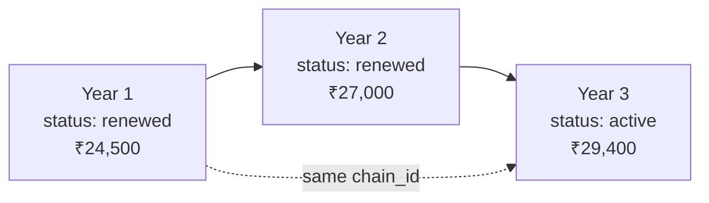
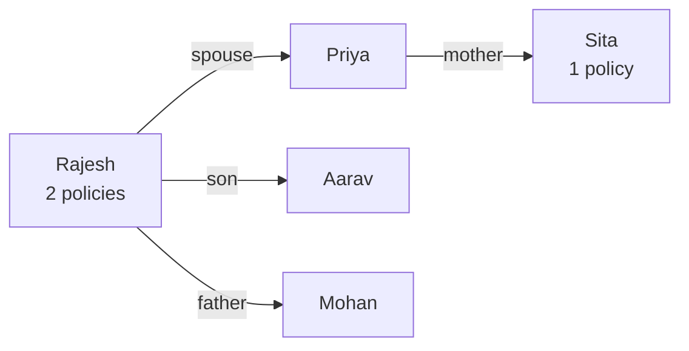
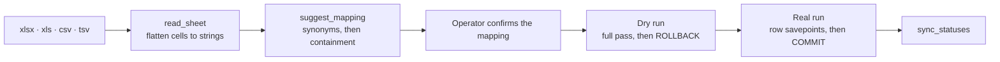
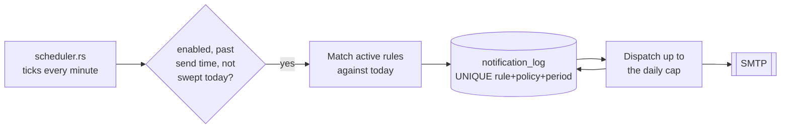

# Design

How StayInsured is built and why. This describes the application as it stands;
the command contract is specified in [API.md](API.md) and the database in
[DATA-MODEL.md](DATA-MODEL.md).

## What the design has to satisfy

StayInsured is used by one insurance agent, on one machine, to hold their entire
book of business. Four constraints follow from that and they decide almost every
choice below.

- **The data is confidential and the machine is not a server.** A laptop gets
  lost. The book is therefore encrypted at rest, and the key exists only while
  the app is unlocked.
- **There is no backend.** No account, no sync, nothing to keep running. The
  app is useful on a train. The single outbound connection it makes is to the
  agent's own mail server, to send the agent's own reminders.
- **History is the product.** An agent needs to know what a client paid three
  years ago and when cover actually ran. Nothing that represents a policy year
  is ever overwritten.
- **The existing book arrives as a spreadsheet.** Onboarding means reading
  somebody's real, messy Excel file without them retyping it or losing rows.

## Shape of the system

One process, three layers, one bridge.

The rules that keep this honest:

- **The interface never writes SQL.** It calls commands; commands call
  repositories; repositories own the queries. Adding a screen means adding a
  command and a page, and does not touch the database layer.
- **`src/lib/api.ts` is the only place that calls `invoke`.** Every screen goes
  through it, so the command surface has exactly one typed definition on the
  frontend and errors are normalised in one function.
- **Commands are thin.** They resolve the unlocked database, choose a
  transaction or a read, and delegate. Business rules live in `repo/` and in the
  importer, where they are reachable from tests without a window.

## Process lifecycle

The app is a tray-resident background application, not a document window.

- Closing the window hides it. `on_window_event` intercepts `CloseRequested`,
  cancels the close and hides the webview, so the process survives to do
  scheduled work. Quitting is deliberate, from the tray menu.
- The tray menu offers Open, **Lock now** and Quit. Locking from the tray drops
  the database handle without quitting, emits `session:locked` so the webview
  moves to the lock screen rather than showing a book it can no longer read, and
  brings the window up on it.
- Launched with `--background` (how the autostart plugin starts it at login) the
  window stays hidden and the app goes straight to the tray.
- A second launch never becomes a second app. `tauri-plugin-single-instance` is
  registered before every other plugin, which is what the plugin requires, so a
  launch that finds a copy already running is turned away inside plugin setup —
  before it reaches `AppPaths`, let alone the book — and the copy already running
  does what the tray's **Open** does. The second launch's own arguments are
  deliberately not read: an autostart launch arriving while the operator has the
  window open would otherwise hide it on them.
- What that guard does not cover is a book reached twice from different machines,
  a synced or shared data folder among them. It is one lock per machine, held on
  the bundle identifier, not a lock on the database file.
- Startup order in `run()`: tracing, the single-instance guard, the rest of the
  plugins, resolve `AppPaths` and create the data directories, register
  `AppState`, build the tray, start the reminder scheduler, register commands.

Everything the app writes lives under one directory, so a backup or a move to a
new machine is a single folder copy.

| Platform | Data directory |
| --- | --- |
| macOS | `~/Library/Application Support/com.stayinsured.app` |
| Windows | `%APPDATA%\com.stayinsured.app` |
| Linux | `~/.local/share/com.stayinsured.app` |

It holds `stayinsured.db`, `vault.json`, `backups/` and `logs/`. Scanned
documents are not among them: they are blobs inside the database, so the book is
one file to copy and one file to encrypt.

## Security model

The password is the only key to the book, and it is never stored.

- **`vault.json` holds no secret.** It carries the KDF version, salt and cost
  parameters — exactly what is needed to turn the password back into the key,
  which is why it can be read before anything is decrypted.
- **The key goes to SQLCipher in raw form.** The password has already been
  stretched with Argon2id, so SQLCipher's own KDF would only add cost without
  adding strength. `apply_key` rejects anything that is not 64 hex characters.
- **A wrong password is detected by reading `sqlite_master`.** SQLCipher reports
  a wrong key as a corruption-shaped error, so `verify_readable` translates
  `NotADatabase` and `DatabaseCorrupt` into `bad_password` rather than leaking a
  scary internal error.
- **Locked is a real state, not a UI flag.** `AppState` holds
  `RwLock<Option<Arc<Database>>>`. Before unlock there is no connection and no
  key in memory, so every data command fails with `locked` by construction
  rather than by remembering to check.
- **The `users` row keeps a separate Argon2 password hash.** It is independent of
  the database key so that adding staff accounts later does not require
  re-keying the database.
- **"Remember on this device" is opt-in and reversible.** The derived key goes to
  the OS keychain under service `com.stayinsured.app`, account `database-key`.
  `forget_device` deletes it.
- **The mail password lives beside it, under account `smtp-password`, and not in
  the database.** A backup is copied to a cloud folder and an export is emailed
  around; neither should carry a working credential for the agent's mailbox.
  `set_smtp_password` writes it and no command reads it back.
- **Changing the password re-keys the database and can be rolled back.**
  `change_password` verifies the current password, runs `PRAGMA rekey`, then
  writes the new `vault.json`. If that write fails the database is re-keyed back
  to the old key, because a database whose key no longer matches its vault file
  is unopenable.

Losing the password with no keychain entry means the data is unrecoverable. That
is the intended property of encrypting it, and the first-run screen says so.

### Backups

`backup_now` uses `VACUUM INTO`, not the SQLite online backup API, which
SQLCipher rejects. The result is a compacted copy encrypted with the same key,
taken safely while the app is running. Backups are named
`stayinsured-YYYYMMDD-HHMMSS.db`, mirrored to `backup_dir` when that setting
points at an existing directory, and pruned to `backup_retention` (14 by
default). Because they carry the same encryption, a cloud-synced folder is a
reasonable place to keep them.

## Data layer

**One encrypted connection behind a mutex.** A desktop app has a single writer
and short-lived reads, so a connection pool buys nothing and would complicate
SQLCipher key handling. `Database` exposes exactly two ways in:

- `with(|conn| …)` for reads.
- `with_tx(|tx| …)` for anything that writes, committing on `Ok` and rolling
  back on `Err`.

Every write command uses `with_tx`, so a partially applied multi-statement
change cannot survive an error.

Connection pragmas on open: `journal_mode = WAL`, `foreign_keys = ON`,
`busy_timeout = 5000`, `synchronous = NORMAL`.

`busy_timeout` has less to do now that one machine runs one copy of the app, and
it stays anyway. The guard is a lock per machine on the bundle identifier, not on
the database file: a book kept in a synced or shared folder can still be opened
from a second machine, and WAL — which wants a shared-memory file beside the
database — is worse than useless there. Waiting five seconds for a lock is the
cheapest thing left between that arrangement and a corrupt book.

**Migrations are append-only.** `MIGRATIONS` is an ordered list of
`(version, sql)` compiled in with `include_str!`, applied inside one transaction
and tracked in `PRAGMA user_version`. A shipped entry is never edited; a change
is a new numbered file. `session_state.schemaVersion` reports the latest version
so the interface can see what it is talking to.

**Query construction is allow-listed.** `query::Conditions` accumulates WHERE
fragments with their bound values; values are always bound, never interpolated.
Sort keys resolve through per-repository `SORTABLE` tables and `IN` lists are
filtered against the known enum values, so a client-supplied sort or category
cannot reach the SQL text. Pagination clamps page size to 1–500 and defaults to
50.

## Domain design

### Renewal chains

The central modelling decision: **a policy row is never mutated on renewal.**
Each policy year is its own row, linked backwards by `previous_policy_id` and
sharing a `chain_id` across the whole lineage.

This makes the annual record permanent, turns renewal and lapse reporting into a
straight query instead of an audit-trail reconstruction, and gives the
`is_renewed` flag a precise definition: a policy is renewed when a row exists
whose `previous_policy_id` points at it.

`renew` carries forward everything the caller does not restate — frequency,
payment mode, nominee, vehicle number, commission, and the lives covered —
defaults the new term to the day after expiry plus a year minus a day, copies
the `policy_members` rows, and marks the expiring year `renewed`.

Because `(insurer_id, policy_number)` is unique, **a renewal needs a policy
number that differs from the expiring year's** when the insurer is the same. The
renewal dialog pre-fills last year's number and says insurers usually issue a
fresh one; leaving it unchanged returns a `conflict`.

### Status is derived from the calendar, not typed in

`sync_statuses` reconciles every policy against today in five passes, in order:

1. Anything with a successor becomes `renewed`, whatever it said before.
2. Anything `renewed` without a successor becomes `active`, to be read by the
   passes below like any other open year.
3. `active` past its expiry date becomes `expired`.
4. `expired` for more than 30 days (`LAPSE_GRACE_DAYS`) becomes `lapsed`.
5. `expired` or `lapsed` with an expiry date in the future returns to `active`.

Passes 1, 2 and 5 are the correction paths: they mean a mistyped date, a
back-dated edit or a deleted renewal heals itself instead of leaving a wrong
status behind. Pass 2 is what stops a policy whose renewal was deleted sitting
at `renewed` for ever, off the renewals desk while its cover is still running.
`cancelled` is only ever set by hand and is never overwritten.

It runs on every unlock, after every real import, and on demand from
**Recalculate** on the renewals screen, so "expiring" and "lapsed" always mean
what they say.

### One view feeds every list

`policy_overview` joins policy, client, insurer and product and adds two
computed columns: `days_to_expiry` (live, against local midnight) and
`is_renewed`. Every grid, filter, dashboard tile and export reads from it, so
they cannot disagree about what "expiring in 30 days" means. `POLICY_COLUMNS`
pins the column order that `Policy::from_row` expects.

### Client identity

Client codes are `CL-00001`, allocated by taking the maximum numeric suffix
matching `CL-[0-9]*` and adding one, so a manually entered code never blocks the
sequence. Deduplication resolves in a fixed order — client code, then email,
then phone, then name — and the importer depends on that order.

Archiving is the soft option and the default one offered in the UI; deleting a
client cascades to their policies.

### A family is edges between clients

**Everybody on a family floater is a client.** There is no member entity, no
household table and no family id: `client_relations` holds directed edges, and a
family is the set of clients reachable from one of them by following those edges
in either direction. Migration 005 moved the old `insured_members` rows across —
`repo::relations` is what replaced `repo::members`.

The reason is the day a dependent buys cover. A son on his father's floater who
takes out his own two-wheeler policy is, under a member model, a name inside
another person's record that has to become a client — a migration performed by
hand, at the till, with the old row left behind or deleted. As a client from the
start he is already there, and the new policy simply belongs to him. Nothing about
the family changes.

Edges rather than a family id, because a person belongs to more than one family. A
married man is in his wife and children's family and in his parents'. An id forces
a choice, and marriage or death then means merging or splitting ids across every
row that carries one; edges mean adding or removing one row.

Consequences worth knowing, all of them enforced in `repo::relations`:

- **The pair is unique, not the direction.** `link` rewrites an edge that exists
  either way round, so "father" recorded on the son's page corrects the "son"
  recorded on the father's instead of contradicting it. `Relative.outgoing` tells
  the interface which way the surviving edge points, and it renders the stored word
  with a preposition — "Son" one way, "Son of" the other — rather than inverting
  it. Inverting would mean guessing gender, and would be wrong about a mother.
- **The walk is done in Rust, not in a recursive CTE.** Both editions must agree,
  the older SQLite behind the Windows 7 build is a poor place to rest a graph
  traversal, and a visited set cannot loop for ever the way a recursive query whose
  key includes the depth can. It stops at 12 steps: an agency's book is not a
  genealogy, and one mistaken edge between two families should not turn a client
  page into the whole client list.
- **Ancestry cycles are refused; other loops are not.** Only parent and child edges
  point up and down a family, so only they can contradict themselves. A couple who
  are also each other's cousins is one family with two ways through it, and
  `client_family` returns both edges because the book holds both.
- **Family archive and family delete reach one step out and stop.** An in-law's own
  parents are their own household. Reaching further would mean a delete confirmed
  against a list of three could take a dozen people, and what was confirmed is what
  should go.
- **A dependent is derived, never stored.** No policy of their own, and named as
  somebody's relative. `clients::list` drops dependents when browsing, keeps them
  when searching, and the dashboard counts policyholders through the same
  `IS_DEPENDENT` predicate — otherwise a book of 2,000 policyholders would report
  5,000 clients and every child as a client with no email address. Buying a policy
  makes somebody a policyholder with nothing to migrate.
- **A policy covers its holder or somebody related to them.** `set_members` writes
  the set through an `INSERT … WHERE`, so an id from outside the family is dropped
  rather than trusted.

### Stored documents

Scans live in the database as blobs, not as files beside it. The alternative —
a `documents/` folder addressed by path — was the original scaffolding, and it
fails the two promises the app is built on: the folder would be the one
unencrypted part of a client's record, and `backup_now` is a single `VACUUM INTO`
of the database, so those files would be the one part a backup silently left
behind.

The bytes therefore travel a deliberate route. Attaching passes a **path**, and
`repo::documents::attach` reads the file itself, so nothing large crosses the
bridge as JSON. Reading passes **raw bytes** back through `tauri::ipc::Response`
rather than base64, and the interface turns them into a `Blob` URL that it revokes
when the viewer closes. Bytes reach the disk again only through
`save_document_copy`, at a path the agent chose. Attaching is a copy, never a
move: the agent's own file is untouched, so removing an attachment cannot lose
the original.

Three limits keep the book a size that can still be copied on every backup: 20 MB
per file, PDF, PNG, JPG and WEBP only, and `UNIQUE (client_id, sha256)` so the
same file attached twice to one client is refused as the mis-click it is. A
document hangs off a client, and optionally off one of their policies; deleting
that policy sets the link to `NULL` rather than shredding the paperwork.

## Import pipeline

Import is the highest-risk operation in the app: it takes an unknown file and
writes to the whole book. The design assumes the file is wrong.

- **Everything happens in one transaction.** A dry run does the entire pass and
  rolls back, so the report is what a real run would do — not a guess. A real
  run lands completely or not at all.
- **Each row is its own savepoint.** Without this, a row that creates a client
  and then fails on the policy would leave the half-built client behind. A
  failed row is rolled back to the savepoint and its report counters are wound
  back with it.
- **Four fields are mandatory**: client name, policy number, insurer, expiry
  date. `run` refuses before touching data if any of them is unmapped, or if the
  mapping names a column the file does not have.
- **Blanks fill, values never overwrite.** `fill_client_gaps` uses
  `COALESCE(NULLIF(…))`, so a second import can add missing phone numbers
  without erasing better data.
- **Header matching is two-pass.** Exact synonym match first across all fields,
  then containment, and each column is claimed once — so
  "Policy Expiry Date (DD/MM/YYYY)" lands on `expiryDate` without stealing the
  column that `startDate` needs.
- **Real-world values are normalised, not rejected.** Day-first dates, Excel
  serials, `₹10,00,000`, `Rs. 24,500.50`, "Mediclaim" → health, "two wheeler" →
  motor, `+91 98765-43210` → `+919876543210`. A malformed email is dropped and
  reported rather than sinking the row.
- **Insurers and plans are resolved, not duplicated.** `find_or_create` matches
  on name or short code, then on a contained name, before creating anything, so
  "HDFC Ergo" does not become a third spelling of an insurer already on file.
- **The issue list is capped at 300.** A broken file produces a readable report,
  not fifty thousand lines. Every real run is recorded in `import_batches` with
  its mapping and its errors in `import_errors`.

Export mirrors it: one column table paired with value extractors drives both
`.xlsx` and `.csv`, so the two formats cannot drift. Numbers are written as
numbers so totals and sorting work in Excel, and an unsupported extension is
refused with a clear message.

## Reminders

Chasing renewals is the work the app exists to remove, and it is the one place
where a bug is visible to the agent's clients rather than to the agent. Two
failures matter: a client who hears nothing, and a client who hears the same
thing five times. The design is arranged around the second, because the first is
recoverable and the second is not.

**The sweep is two halves that meet at a table.** Planning decides what should
go out and writes it to `notification_log`; dispatch takes what is in the table
and tries to deliver it. Keeping them apart is what lets a send fail — a lid
closing mid-run, a mail server having a bad morning — without either losing the
reminder or sending it twice.

- **`UNIQUE (rule_id, policy_id, policy_period)` is the guarantee, not the
  bookkeeping.** The row is written with `INSERT OR IGNORE` before anything is
  sent, so a reminder fires once per policy year however often the sweep runs,
  and a crash mid-send costs at most one duplicate instead of a mailshot.
- **A rule fires on an exact date, not within a window.** "30 days before" means
  expiry is exactly 30 days from today. A window would re-match tomorrow and
  lean on the deduplication to stay quiet; an exact match means the ladder is
  legible from the rules table alone. Negative offsets chase after expiry and
  match only `expired` or `lapsed` policies with no successor.
- **A blocked reminder is recorded, once, as `skipped`.** An opted-out client or
  a missing address is a fact about the book, not a transient error. Writing it
  down means the operator can see who is unreachable and the same client is not
  re-raised every morning.
- **A failed send stays queued for three attempts.** Only then is it parked as
  `failed` for a human. Most mail failures are a server being briefly unwell and
  should not need the operator.
- **The cap limits sending, not queueing.** Mailbox providers throttle bulk
  sending, so what is over `daily_send_cap` stays in the outbox and goes
  tomorrow, in order.
- **Renewing cancels what is still queued** for the year that was renewed. A
  reminder written yesterday must not chase a client who has since renewed.
- **Practice mode is the default.** `dry_run` starts `true`, so a fresh install
  works everything out and sends nothing until the agent has read what it would
  have said.

**The scheduler asks a question rather than setting an alarm.** A thread ticks
once a minute and asks whether today's sweep has already run — reminders on, the
send time passed, `last_sweep_at` not today. Phrased that way, a missed slot is
harmless: a laptop asleep at nine sweeps as soon as it opens, and one left open
all day still sweeps exactly once. It emits `reminders:swept` so the screen
shows today's numbers rather than yesterday's.

**The engine does not know what Tauri or SMTP are.** `sweep` takes a `Sender`
and an `Alerter` trait object, which is why the whole of it — due matching,
deduplication, the cap, the retry ladder — is exercised in tests against a
recording fake, with no mail server and no window.

**Templates escape by default.** `{{name}}` HTML-escapes; `{{{name}}}` does not
and is reserved for values the app builds itself, such as the digest table. A
client called "Sharma & Sons" therefore cannot break the message. A name the
catalogue does not hold renders as empty rather than shipping `{{clint_name}}`
to a client's inbox, and the editor lists it as unknown so the typo is caught
before it goes out. Every message is sent as HTML with a plain-text part derived
from it, so the two cannot say different things.

## Interface architecture

- **React 18 + Vite + Tailwind 4**, one file per screen under `src/pages/`,
  shared widgets in `src/components/`.
- **TanStack Query owns all server state.** No global store. Nothing is held as
  fresh: a screen asked for again asks the book again, because a read is a local
  SQLite query and the core moves on its own — the reminder sweep sends, the
  status pass expires policies — while the window sits there.
  `refetchOnWindowFocus` is off because refetching on every focus makes a
  desktop app feel jumpy, and `retry` is off because a local database failure
  will not fix itself. Screens setting their own `staleTime: 0` to escape a
  shared default is how a cleared filter came to be answered from the cache it
  was meant to replace.
- **One query client, in `src/lib/queryClient.ts`, used by the app and by the
  tests.** A successful write invalidates the whole cache rather than the keys
  the call site happens to remember: a renewal moves the renewal counts, the
  sidebar badge, the dashboard and the client it belongs to, and naming those
  keys mutation by mutation is how they fall out of step. A read is a local
  SQLite query, so asking everything again costs almost nothing. A mutation that
  writes nothing — a file picker, an export, a copy saved to disk — is marked
  `meta: readsOnly` and skips the invalidation.
- **A read has four answers, not two.** `AsyncPanel` in `components/ui.tsx`
  draws the spinner, the failure with what it said and a Try again, or the
  rows; the caller supplies the empty state and distinguishes an empty book from
  a search that found nothing. Screens that only handled `isLoading` drew their
  empty state on failure, so a core that could not answer looked exactly like a
  book with nothing in it.
- **`useListFilter` owns what a list is asking for.** URL search terms including
  later changes, the 250 ms debounce, returning to page one whenever the
  question changes, and dropping empty values instead of sending `""`.
- **`HashRouter`**, because the app is served from a file-based webview.
- **`App.tsx` is the session gate.** It queries `session_state` and renders
  either `LockScreen` or the routed shell. Lock state is therefore driven by the
  backend, not by frontend routing.
- **Locking removes every query except the session, and writes the new session
  in.** `App.tsx` owns that in one `onLocked`, used both by **Lock app** and by
  the `session:locked` event. Emptying the whole cache instead would take the
  session query with it, and since `refetchOnWindowFocus` is off nothing would
  fetch it again: the shell would keep rendering an unlocked book against a
  database handle that no longer exists, with no way back to the lock screen.
- **The keychain unlocks the app as it starts, not whenever the lock screen
  appears.** `LockScreen` takes `autoUnlock`, which `App.tsx` turns off once the
  book has been open, so locking a trusted device by hand asks for the password
  instead of letting itself straight back in.
- **`src/lib/types.ts` mirrors `src-tauri/src/models.rs`.** Rust serialises with
  `#[serde(rename_all = "camelCase")]`, so the two files are the same shape in
  two languages and must be edited together.

Window and permissions are deliberately narrow: 1440×900 with a 1024×680
minimum, a CSP of `default-src 'self'` widened only to `blob:` for images and
frames so the document viewer can render what it has just read out of the
database, and a capability file granting only dialog, notification, opener,
autostart, updater, restart and window dragging. There is no asset protocol,
because nothing the app displays comes from a file on disk.

## Error model

`AppError` is one enum with a `kind()` tag, serialised to the interface as
`{ kind, message }`. The tag lets the UI react to a class of failure without
string-matching messages; the message is written for the person reading it, not
for a log file.

| `kind` | Meaning |
| --- | --- |
| `locked` | No unlocked database. The UI shows the lock screen. |
| `bad_password` | Wrong password, including a wrong SQLCipher key. |
| `already_initialised` | `setup` called on an installation that has a vault. |
| `validation` | The input is wrong and the message says how. |
| `not_found` | The named entity does not exist. |
| `conflict` | A uniqueness or in-use rule refuses the change. |
| `mail` | The mail server is unconfigured, unreachable or refused the message. |
| `internal` | Database, file, serialisation or spreadsheet failure. |

Constraint violations are translated at the repository boundary, so a duplicate
policy number reads "That policy number already exists for this insurer. Use
Renew to add the next year." instead of surfacing SQLite text, and the same file
attached twice to one client reads "That file is already attached to this
client." An insurer that still carries policies cannot be deleted at all —
deactivating is the intended way to retire one.

Which rule was broken is decided by the columns the message names rather than by
the phrase it names them in: `repo::constraint_names` looks for each column on
its own, because SQLite writes them table-qualified and in index order and a
translation matched on the whole phrase goes quietly back to SQLite's wording the
day a table is renamed or an index reordered. Nothing fails when it does — the
`kind` is still right and the screen still behaves — so only somebody reading a
message off a screen would notice.

## Testing strategy

The data layer holds the money and the renewal dates, so that is where the tests
are. `src-tauri/src/tests.rs` exercises it end to end against a real encrypted
database in a temporary directory, with no window:

- migrations and seed apply, and the 60/30/15/7/1 reminder ladder is active
- a wrong key is reported as `bad_password`
- the vault records 64 MiB over three passes, salts every book differently, and
  what it writes beside the database contains neither password nor key
- changing the password re-keys the database: the old one stops working and the
  book is still there behind the new one
- a password verifies against its hash without being stored, and two people
  choosing the same one do not look alike
- a setting left blank falls back to its default, and a number that is not one
  falls back rather than failing the sweep
- client codes increment and deduplication resolves in the documented order
- matching falls from code to email to phone to name, and an unknown code keeps
  looking rather than deciding there is no such client
- a code already in use is refused, and a code typed by hand moves the counter
  past it
- archiving puts a client away without touching their policies
- deleting a client takes their policies but leaves their family standing, and
  deleting the family reaches one step out and stops
- archiving a family moves the household, stops at the in-laws, and reverses
- a family reads the same walked from any of them
- a relationship recorded twice, once from each end, is still one edge
- nobody can be their own ancestor
- a dependent is hidden from the browse list, found by name, brought in by the
  toggle, and stops being one by holding a policy
- the dashboard counts policyholders rather than people, so a child with no
  email address is not something to chase
- a blank field is stored as nothing rather than as empty text
- renewal builds a chain, carries values forward and preserves last year's
  premium
- statuses follow the calendar and the dashboard agrees with them
- a duplicate policy number for one insurer is refused, while two insurers may
  each use the same number
- a cancelled policy is left alone by the sweep in both directions
- an expiry corrected to a future date brings the policy back to active
- editing a policy leaves its chain, its year and last year's record alone
- a status the rest of the app cannot read is refused
- a chain keeps exactly one open year however many times it is renewed, and a
  year that already has a successor cannot be renewed a second time
- renewing a cancelled year leaves it cancelled, still marked as renewed and
  still ignored by the sweep
- deleting a year leaves the earlier ones standing
- a policy covers its holder or somebody related to them, and nobody else
- a life named on a policy in a spreadsheet is not entered as a client twice
- an insurer holding policies is refused deletion and retired instead, and
  retiring one leaves its policies readable
- deleting a plan detaches it from the policies that used it rather than
  taking them with it
- an abbreviated insurer name matches the one already in the book, and only a
  name nothing matches is added
- a plan is unique to its insurer and must carry a known category
- a messy spreadsheet maps correctly, a dry run writes nothing, and re-importing
  updates in place instead of duplicating
- an unmapped required field refuses the import
- export writes both formats and refuses a third
- a backup reopens with the same key
- Indian date and money formats parse
- a page size is clamped to something a screen can draw, and a sort key that is
  not on the allow-list falls back instead of reaching the SQL
- a percent sign or underscore typed into a search box is looked for rather
  than obeyed as a wildcard
- a filter value the code does not know is dropped, and a filter left with
  nothing is dropped whole
- a rule fires on its day and not before, and once however often the sweep runs
- a dry run writes nothing and sends nothing
- an export carries every column and reads like the screen, and a format that
  cannot be written is refused with the ones that can
- a header maps by name and then by resemblance, no column is claimed twice,
  and one with no field is left alone
- the blank template's own headers map themselves, and its example row survives
  the importer
- one rule writes to one policy year once, and cancelling does not free the slot
- the outbox moves only the ways the screen allows: what is queued can be
  cancelled but not resent, what has gone can be neither, and a skip or a
  failure can be tried again with the attempt count reset
- only queued rows past their date leave the outbox, oldest first, capped
- renewing cancels what is still waiting and leaves what has gone
- an opt-out and a missing address are recorded rather than retried
- a failed send stays queued until it gives up, and the daily cap holds the rest
  back for tomorrow
- renewing cancels the reminder still waiting to go out
- the ladder lists furthest ahead first, with the chase after expiry seeded but
  switched off
- a template a rule still sends cannot be deleted until the rule points
  elsewhere
- a rule writing to a client is refused without a message, while the provider
  digest may go without one, and timing beyond a year either side is refused
- a rule the form does not place joins the ladder at the end rather than the
  top, and an edit that names no place leaves it where it was
- deleting a rule leaves the record of what it sent, no longer pointing at it
- a template fills in the policy, refuses unknown names, and cannot be broken by
  a client name containing an ampersand
- the plain-text part keeps the shape of the HTML it was derived from
- a document copies into the book byte for byte, refuses a second copy of itself,
  refuses a type that is not a scan, and outlives the policy it was filed under
- the same file attached twice is refused in the words the panel prints, not in
  SQLite's
- deleting a client takes their documents and the bytes with them

Run them with `cd src-tauri && cargo test --lib`.

The interface has a suite of its own, run with `npm test` (Vitest, jsdom,
Testing Library) and included in `npm run check`. It renders the real screens
against a fake core: `src/test/backend.ts` answers every `invoke` from an
in-memory book, applying the same validation, normalisation and cascades the
Rust repositories do, so a screen that sends a payload the core would refuse
fails here too. The Tauri bridge itself — dialogs, the clipboard, the updater,
the event stream — is mocked in `src/test/tauri.ts`, and the clock is frozen at
a fixed date so an expiry is always the same number of days away.

The tests are written from the operator's side: they click what is on screen
and read what comes back, rather than reaching for a component's props. What
they cover, screen by screen, is the shell and dashboard, the client list and
record, the policy list and form, renewals, insurers and plans, reminders with
their rules and messages, import, settings and the lock screen. `src/test/`
holds the harness and its own README.

A test that describes a bug still open is marked `it.fails`, so the suite stays
green while the marker keeps the bug written down; flipping one back to `it` is
what fixing it looks like.

The frontend is also covered by `tsc --noEmit`.

`npm run check` is the whole gate in one command: the typecheck, then
`cargo fmt --check`, `cargo clippy --all-targets -- -D warnings` and the tests.
It takes about twelve seconds. Clippy warnings fail rather than accumulate,
which is only sustainable because the codebase carries none.

Work reaches `main` by a direct push rather than a pull request, so the gate has
to sit before the push: `.githooks/pre-push` runs `npm run check`, enabled once
per clone with `npm run hooks`. The **Checks** workflow runs the same commands
on every push to `main`, catching the push that used `--no-verify` or came from
a clone where the hook was never enabled. It also re-photographs the app and
fails when the screenshot set has gained or lost an image, since **Site**
re-photographs before publishing but never compares. The release workflow
repeats the tests on macOS before building any installer, so a release is never
cut on a failing data layer.

## Build and release

Vite builds the frontend into `dist/`, which Tauri embeds. `rusqlite` bundles
SQLCipher and vendors OpenSSL, which is why the Windows job checks for Perl and
NASM. The release profile uses LTO, `opt-level = "s"`, symbol stripping and
`panic = "abort"`.

Pushing a `v*` tag publishes a GitHub release with a universal macOS `.dmg` and
Windows `.msi` and `.exe`; running the workflow by hand builds the same
installers without announcing a version. Either way the run keeps a copy of the
installers, so a release that builds and is then refused by GitHub — which has
happened once — can be filled in without building again. The workflow refuses to build
when the tag and `tauri.conf.json` disagree, so installers cannot ship under the
wrong version. Releases are unsigned, and both installers therefore warn on
first launch.

The `.exe` refuses to install below Windows build 17134 — Windows 10 version
1803 — through `src-tauri/installer-hooks.nsh`. WebView2, the Rust standard
library and Tailwind 4 each rule out Windows 7, 8 and 8.1 on their own, so the
installer says so and leaves the machine untouched rather than installing an app
whose window can never open.

Reaching those machines is `legacy-windows/`, a second edition on Electron 22 with
this core reimplemented in TypeScript. A probe cleared the runtime first — on a
Windows 7 SP1 machine Electron 22 starts, a native SQLite module loads, and the
schema in `src-tauri/src/db/schema` applies to a plain file with a row written and
read back — and that probe still runs on every build of it. It releases from its own
workflow on `legacy-v*` tags, separate from the app's.

Two decisions there reach back into this code. The edition does not encrypt: it
opens a plain SQLite file, so `SessionState` carries an `encrypted` flag that this
core answers `true` and that one answers `false`, and the lock screen and the
security section of Settings read it rather than promising encryption unconditionally.
And its interface is this app's `src/`, built with the `@tauri-apps/*` imports
aliased onto shims over Electron IPC rather than copied — so a screen changed here
changes there, and a screen that quietly hard-codes a claim about encryption breaks
an edition its author was not thinking about.

The cost that decides that edition's future is drift: every rule here now exists
twice. Its `src/tests/` ports the cases in `src-tauri/src/tests.rs` one for one and
names each original, and its `parity.test.ts` reads the `generate_handler!` list out
of `lib.rs` and fails if the two command surfaces disagree by a single name — a
command added here and forgotten there is otherwise found by an operator.
`DEVELOPER.md` carries what is built there and what is not.

Both editions now refuse a second launch and bring the running window forward
instead, and they answer it the same way, because the hazard is the same one: two
processes on one book, with encryption no help at all since both hold the key. The
one difference is what each exempts. That edition is also the Windows 7 probe, so
`--probe`, `--probe-only` and `--capture` never ask for the lock and still run
beside an open app; this one has no diagnostics to exempt, and every launch of it
is the app.

**An installed copy updates itself.** The same release carries an
`.app.tar.gz` for macOS and a `.nsis.zip` for Windows, each with a `.sig`, plus
a `latest.json` describing the newest version. `tauri-action` writes all of them
when `TAURI_SIGNING_PRIVATE_KEY` is set, merging the two platform jobs into one
`latest.json`. On launch, once the book is unlocked and the window is on screen,
`src/lib/updates.ts` reads
`https://github.com/laksagent-png/StayInsured/releases/latest/download/latest.json`
and offers the update; accepting downloads it, replaces the app and offers a
restart.

The signature is minisign, generated by `npm run tauri signer generate`, and is
unrelated to Apple and Windows code signing — an unsigned build still updates
itself. Its purpose is that an installed app installs only what this repository
published, since an update endpoint is otherwise a way to hand every user
arbitrary code. The public half lives in `tauri.conf.json`; the private half
exists only as a repository secret, and losing it means no existing install can
ever be updated again.

Two consequences worth stating plainly. The check is silent: offline, or already
current, shows nothing, because a modal error about a failed update check is
worth less than the interruption costs. And an update reaches only people
already running a build that knows how to look — 0.1.0 has no updater, so those
installs have to be replaced by hand once.

## Built, and deliberately not built yet

Working today: clients and the families between them, policies with renewal chains, the
renewals desk, the dashboard, insurers and plans, spreadsheet import with a dry
run, export, reminders — rules, templates, the outbox and the daily sweep over
the agent's own SMTP server — stored documents, settings, encrypted backups, lock
and unlock, and signed self-updating from the GitHub release.

The schema still carries tables that no screen writes to: `premium_payments`,
`commissions`, `claims`, `audit_log` and `saved_views`. They exist because their
shape affects the design of what is built.

Unbuilt, in the order they are worth building: the reporting pack, premium and
commission tracking, claims, and multi-user logins. Claims come after documents
on purpose — an intimation without the letter attached to it is half a record.
The [README](../README.md) is the running list.
